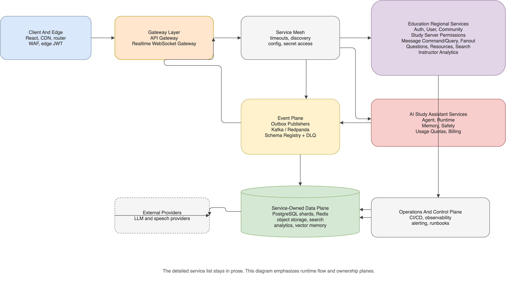
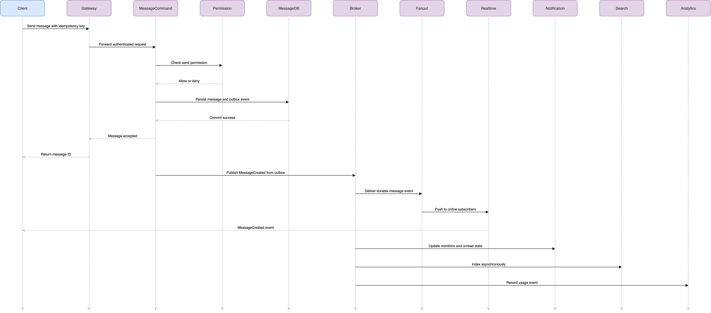
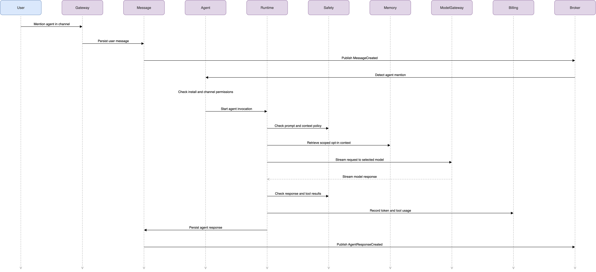
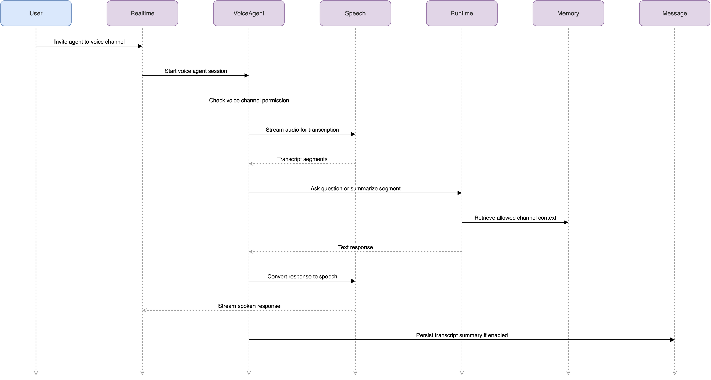

# System Design

## Backend Architecture Overview

This backend is designed as a cell-based microservice architecture for a real-time community/chat platform. The first product wedge is an education SaaS product: Discord-like Study Servers for courses, bootcamps, tutoring groups, and learning communities, with AI teaching assistants and instructor operations built in. The goal is to support a local production-ready education MVP first, while preserving architectural boundaries that can scale toward very large traffic later.



Editable source: [`system-backend-architecture.drawio`](docs/diagrams/system-backend-architecture.drawio) | PNG export: [`system-backend-architecture.drawio.png`](docs/diagrams/system-backend-architecture.drawio.png)

## Product Design vs Backend Architecture

| Location | Contents | Use when |
|---|---|---|
| [`docs/product-design/`](docs/product-design/README.md) | Target **browser UI** mockups, user journeys, `vision.md`, **`visibility-and-social-model.md`**, interactive tour | Frontend routes, stakeholder demos, slice UX scope |
| [`docs/diagrams/`](docs/diagrams/) | **Engineering** service topology, message paths, agent invocation | Service boundaries, events, scaling, implementation |

The education MVP ships as a **web application** (React SPA in the browser). Native mobile and desktop wrappers are out of scope for the first MVP; see `docs/product-design/vision.md` § Platform.

## Implementation Tracking (agent order)

| Phase | Milestone | Project | Status |
|-------|-----------|---------|--------|
| Backend MVP | [Education MVP](https://github.com/Vinosaamaa/chanter/milestone/1) | [#1](https://github.com/users/Vinosaamaa/projects/1) | Done (#11–#24) |
| Production UI | [Production Frontend](https://github.com/Vinosaamaa/chanter/milestone/3) | [#3](https://github.com/users/Vinosaamaa/projects/3) | **Active** (#48+) |
| Workable app | [Workable Product](https://github.com/Vinosaamaa/chanter/milestone/4) | [#4](https://github.com/users/Vinosaamaa/projects/4) | After #51 |

**Mandatory agent workflow:** [`docs/operations/agent-workflow.md`](docs/operations/agent-workflow.md).

## Product Architecture Direction

The initial product is a Study Server:

- Educators create Study Servers for cohorts or courses.
- Study Servers contain course/module channels, announcements, support channels, and office-hours workflows.
- Instructors and TAs manage roles, resources, questions, FAQ entries, and support queues.
- Learners use a familiar Discord-like chat experience while getting better answers, summaries, search, and human handoff.
- The first-party AI Study Assistant is a visible, permissioned member that can answer only from approved resources and allowed context.
- Instructor dashboards expose actionable learning operations: unanswered questions, repeated questions, misconceptions, engagement, office-hours load, and AI usage.

The system should not begin as a full LMS replacement. Gradebooks, SCORM import, accreditation workflows, public agent marketplace, enterprise SSO/compliance, and voice agents are later phases.

Later course-commerce direction: once Study Servers prove value, instructors should be able to sell courses inside a Study Server. A course purchase can unlock the correct Study Server, course channels, resources, live classes, recordings, office-hours policies, and AI Study Assistant access. This should be treated as a later creator-commerce layer, not part of the first MVP, because payments, refunds, tax handling, creator trust, fraud prevention, content moderation, and live-video reliability add significant scope.

## Identity, Organizations, And Social Model

Chanter should use global user accounts with scoped roles. A person is not globally a "teacher" or "student" everywhere. Instead, a user can be an instructor in one Study Server, a learner in another, a TA in a bootcamp cohort, and an owner of a private study group.

Recommended hierarchy:

```text
Global User Account
  -> optional Organization or Workspace
    -> Study Server
      -> Channels
      -> Members
      -> Roles
      -> Permissions
```

Default role model:

- `Owner`: created the Study Server or owns the organization workspace.
- `Instructor`: manages course content, assistant access, office hours, FAQs, and analytics.
- `TA`: helps answer questions, manage office-hours queues, and moderate selected channels.
- `Learner`: participates in channels, asks questions, joins office hours, and views allowed resources.
- `Alumni`: keeps limited access after a course ends if the owner allows it.
- `Guest`: temporary or restricted participant.

Roles are assigned by the Study Server owner/admin or organization policy. A learner cannot self-promote into an instructor role. A global profile may show a verified educator badge later, but that badge should not grant permissions inside a Study Server by itself.

Teacher/student verification should start simple and become stronger over time:

- MVP: Study Server owner/admin assigns instructor, TA, and learner roles.
- Near-term: invite links, enrollment codes, and email-domain allowlists.
- Organization tier: Google Workspace or Microsoft login, institution domains, roster import, and SSO later.
- Public creator tier: optional verified educator badge based on manual review, payment identity, or linked organization.

Friends and direct messages can exist, but they are not the core MVP learning workflow. Issue #15 delivers durable Friend Request / Direct Message rules over REST. The Discord-like **Friends Hub** (#31) and **DM voice** (#32) ship in the **Workable Product** phase ([project #4](https://github.com/users/Vinosaamaa/projects/4)), after Production Frontend **#51** (realtime-service). See `docs/architecture/social-hub-and-dm-voice.md` and `docs/operations/agent-workflow.md`. Education DMs need policy controls:

- Users can send friend or DM requests, but recipients must accept.
- Teachers/TAs can disable or restrict learner DMs.
- Study Server owners can disable cross-role DMs or require course-scoped messaging.
- Organization workspaces can enforce stricter policies for minors, schools, or compliance-sensitive programs.
- Abuse reports and blocks should be available before broad DM rollout.

The first version should prioritize Study Server channels, office-hours queues, and instructor/TA workflows over a broad social network. Universal self-serve registration is still useful: anyone can create a Study Server, but trustworthy instructor powers come from server ownership, admin assignment, or later organization verification.

## Architecture Layers

### Client And Edge Layer

Users access the application through a web or mobile client. Static frontend assets are served through a CDN. Traffic then passes through global routing, WAF/DDoS protection, edge rate limiting, and optional edge JWT validation before reaching backend services.

The edge layer exists to keep obvious bad traffic away from the application, route users to a healthy region, reduce latency, and avoid sending static asset traffic to backend services.

### Service Layer

The backend uses Spring Boot microservices. Each service owns one business capability and should be deployable independently.

- Gateway Service owns public REST routing, CORS, edge rate limiting coordination, request correlation, and routing to internal services.
- Auth Service owns registration, login, password hashing, access tokens, refresh token rotation, sessions, and logout.
- User Service owns profiles, display names, avatars metadata, user settings, account status, social graph preferences, friend requests, blocks, and verified educator profile signals.
- Community Service owns organizations/workspaces, Study Servers, course/module channels, members, instructor/TA/learner roles, permissions, invites, and canonical permission evaluation.
- Message Command Service owns message writes, edit/delete commands, question markers, reactions, read receipts, idempotency keys, and durable message creation.
- Message Query Service owns message reads, pagination, history lookup, query-optimized message views, and course-channel history views.
- Realtime WebSocket Gateway owns connected clients, subscriptions, channel authorization, reconnects, typing indicators, presence fan-out, **friend presence subscriptions**, **live DM delivery**, and **DM call signaling** (issues #31–#32).
- Fanout Service consumes durable events and pushes them to the correct realtime gateway nodes.
- Notification Service owns mentions, unanswered-question alerts, unread counts, notification preferences, and delivery state.
- Moderation Service owns bans, kicks, reports, warnings, audit logs, and moderation workflows.
- Media Service owns upload sessions, attachment metadata, course resources, validation policy, object storage integration, signed download authorization, and AI-approved resource status.
- Search Service owns denormalized search indexes for messages, users, channels, Study Servers, approved FAQs, course resources, and summaries.
- Analytics Service owns event ingestion, aggregates, usage metrics, instructor dashboard read models, misconception signals, and office-hours load metrics.
- Agent Service owns agent definitions, personas, Study Assistant installs, channel bindings, requested permissions, model settings, resource grants, and agent lifecycle.
- Agent Runtime Service owns prompt assembly, model routing, grounded answer attempts, tool calls, streaming responses, and conversation orchestration.
- Voice Agent Service owns voice agent sessions, speech-to-text, text-to-speech, voice room participation, and transcript events.
- Memory Service owns opt-in agent memory, summaries, embeddings, retrieval, retention policy, and deletion workflows.
- Marketplace Service owns agent listings, creator publishing, installs, versioning, reviews, and marketplace governance.
- Marketplace Service later owns course listings, creator storefronts, public/private publishing, listing review, marketplace governance, and paid agent listings.
- Billing Service owns SaaS plans, credits, subscriptions, AI usage metering, quotas, provider cost attribution, course purchases, refunds, creator payouts, and paid agent purchases later.
- Safety Service owns prompt-injection detection, content policy checks, output review hooks, abuse signals, and agent evaluation records.

### Event Plane

Cross-service workflows use an event broker such as Redpanda locally or Kafka-compatible infrastructure in production.

Important events include:

- `UserRegistered`
- `UserProfileUpdated`
- `FriendRequestCreated`
- `FriendRequestAccepted`
- `UserPresenceChanged`
- `DirectMessageCreated`
- `DirectMessageCallInviteSent`
- `DirectMessageCallEnded`
- `UserBlocked`
- `OrganizationCreated`
- `OrganizationMemberAdded`
- `ServerCreated`
- `StudyServerCreated`
- `MemberJoinedServer`
- `StudyServerRoleAssigned`
- `InstructorVerified`
- `RoleChanged`
- `ChannelCreated`
- `CourseResourceApproved`
- `MessageCreated`
- `MessageEdited`
- `MessageDeleted`
- `QuestionDetected`
- `QuestionAnswered`
- `QuestionMarkedDuplicate`
- `FaqCandidateCreated`
- `FaqEntryApproved`
- `OfficeHoursQueueJoined`
- `OfficeHoursQueueItemResolved`
- `ReactionAdded`
- `AttachmentUploaded`
- `MentionDetected`
- `ModerationActionCreated`
- `AgentInstalled`
- `AgentRemoved`
- `AgentInvoked`
- `AgentResponseCreated`
- `StudyAssistantLowConfidence`
- `StudyAssistantGroundedAnswerCreated`
- `AgentToolCalled`
- `AgentMemoryCreated`
- `AgentMemoryDeleted`
- `AiUsageMetered`
- `CourseListingPublished`
- `CoursePurchaseCompleted`
- `CourseEnrollmentCreated`
- `CourseAccessGranted`
- `LiveClassScheduled`
- `LiveClassStarted`
- `LiveClassRecordingPublished`
- `VoiceAgentJoined`
- `VoiceAgentTranscriptCreated`
- `MarketplaceAgentPublished`
- `AgentPurchaseCompleted`

Critical writes should use the outbox pattern. A service writes its business data and an outbox record in the same database transaction. An outbox publisher then publishes the event to the broker. This prevents the system from storing a message but failing to notify downstream services permanently.

Consumers must be idempotent because events can be delivered more than once.

### Data Plane

Each service owns its own database or storage system. Other services do not query that database directly.

- Auth data is partitioned by `userId`.
- User profile, social preferences, friend requests, blocks, and verified educator profile signals are partitioned by `userId`.
- Organization and Study Server data is partitioned by `organizationId` where present and `serverId` for Study Server-local data.
- Message data is partitioned by `channelId`, with time buckets for hot channels.
- Notification data is partitioned by `userId`.
- Search data is stored in a search cluster or search read model.
- Analytics data is stored in a data lake or OLAP system.
- Media binaries are stored in object storage, while metadata stays in Media Service storage.
- Agent configuration is stored by server, channel, installed listing version, and permission grant.
- Education MVP data is owned by the service responsible for the action: organizations, Study Server structure, membership, and roles live in Community Service; user profiles, friend requests, and blocks live in User Service; durable questions and messages live in Message Service; course resource metadata lives in Media Service; FAQ/search read models live in Search Service; instructor insight read models live in Analytics Service; assistant installs/grants live in Agent Service; grounded answer attempts live in Agent Runtime Service; and plan/quota state lives in Billing Service.
- Agent memory is stored in a scoped vector store and summary store with explicit retention and deletion policies.
- Marketplace data stores listings, versions, creator profiles, installs, reviews, and governance state.
- Later course-commerce data is split by ownership: Marketplace Service owns course listings, storefront metadata, creator profiles, and listing review state; Billing Service owns purchases, refunds, invoices, creator payouts, and platform take-rate records; Community Service owns enrollment-derived Study Server membership and channel access grants; Media Service owns recording metadata and storage authorization.
- Billing data stores usage meters, credit balances, subscriptions, provider costs, budget limits, course purchases, refund requests, creator payouts, and platform fee records.
- Safety audit data stores policy decisions, prompt-injection signals, model evaluations, and tool-use audit records.
- Redis stores cache, sessions, rate limit counters, presence, and typing state.

Redis is not the durable source of truth. It is used for fast ephemeral or cache-oriented data.

### Control Plane

The control plane manages configuration, secrets, service discovery, CI/CD, observability, and alerting.

Every service should emit structured logs, metrics, health checks, readiness checks, and distributed traces. Every user action should carry a correlation ID across Gateway, services, event broker, and realtime delivery.

## Design Maintenance Workflow

Use installed Cursor workflow skills directly when changing this design:

- Use `grill-with-docs` before making durable architecture decisions so assumptions, tradeoffs, and missing requirements are challenged.
- Use `to-prd` when a system capability needs product goals, non-goals, acceptance criteria, and a test plan.
- Use `to-issues` to split large architecture work into vertical slices that can be reviewed independently.
- Use `zoom-out` or `improve-codebase-architecture` after each major milestone to check service boundaries, data ownership, event flow, permissions, reliability, and observability.
- Use `diagnose` for bugs, failures, performance issues, or flaky tests once code exists.

## Critical Message Write Path

The message write path must stay small, durable, and fast.



Editable source: [`system-critical-message-write-path.drawio`](docs/diagrams/system-critical-message-write-path.drawio) | PNG export: [`system-critical-message-write-path.drawio.png`](docs/diagrams/system-critical-message-write-path.drawio.png)

The synchronous path should only do the work needed to safely accept a message: authenticate, authorize, persist, and acknowledge. Fan-out, notifications, search indexing, and analytics happen asynchronously.

## AI Agent Platform

AI agents are modeled as special permissioned members of a server or channel. They are not hidden background processes. If an agent can read a channel, join a voice room, remember context, use tools, or perform moderation assistance, that capability must be visible and explicitly granted.

The first production agent is the AI Study Assistant for Study Servers. It answers learner questions from approved course resources, approved FAQ entries, and allowed recent context; identifies low-confidence questions; and routes unresolved support to TAs or office-hours queues.

Future agent examples:

- Study assistant that explains topics, quizzes members, and summarizes lessons.
- Meeting assistant that joins voice channels, transcribes discussion, summarizes decisions, and creates action items.
- Moderator assistant that flags spam, suspicious links, raids, or toxic content for human review.
- Game master agent for roleplay, trivia, campaigns, or community events.
- Server helper that answers questions from rules, pinned posts, FAQs, and documents.
- Translator agent that translates messages across languages.
- Character agent with a specific personality, voice, avatar, and response style.
- Coding assistant for programming communities.

The platform should start with the built-in AI Study Assistant first. The marketplace should come later after permissions, memory, safety, billing, and quality controls are proven.

### Agent Invocation Path



Editable source: [`system-agent-invocation-path.drawio`](docs/diagrams/system-agent-invocation-path.drawio) | PNG export: [`system-agent-invocation-path.drawio.png`](docs/diagrams/system-agent-invocation-path.drawio.png)

The important rule is that agent responses become normal durable messages through Message Service. The runtime can stream partial output to the UI, but the final answer should be stored and delivered through the same message pipeline as user messages. For education workflows, every grounded answer should also record resource scope, confidence state, safety state, and usage metering so instructors can audit and manage the assistant.

### Voice Agent Path



Editable source: [`system-voice-agent-path.drawio`](docs/diagrams/system-voice-agent-path.drawio) | PNG export: [`system-voice-agent-path.drawio.png`](docs/diagrams/system-voice-agent-path.drawio.png)

Voice agents should be introduced carefully because they add privacy, latency, and cost concerns. A voice room must clearly show when an agent is present, whether transcription is enabled, and whether summaries or memories are being saved.

Live classes are a related but separate later capability. A live class is a scheduled cohort session tied to a course listing or Study Server. It needs enrollment-based access control, instructor/TA controls, recording consent, transcript/summarization policy, and post-class resource publishing. The first implementation should design the LiveClassSession and access model before adding WebRTC/video complexity.

### Agent Memory And Tools

Agent memory is opt-in and scoped.

Memory scopes:

- No memory: agent only sees the current prompt.
- Recent context: agent can read recent messages in the channel for a short window.
- Channel summaries: agent can use generated summaries for that channel.
- Server knowledge base: agent can use approved documents, FAQs, rules, and pinned content.
- Personal memory: only if explicitly enabled by the user and allowed by policy.

Tool examples:

- Search approved course resources.
- Search approved Study Server FAQ.
- Summarize course channel discussions.
- Suggest FAQ entries from repeated questions.
- Route low-confidence answers to office hours.
- Summarize thread.
- Summarize voice meeting.
- Create poll.
- Create action items.
- Translate message.
- Flag message for moderator review.
- Search approved files or documents.

Every tool needs a permission grant. High-risk tools should require admin approval and may require confirmation before execution.

### Agent Marketplace

The marketplace should sell or distribute installable agent templates after the internal agent platform is stable.

Marketplace items can include:

- Agent personalities.
- Specialized assistants.
- Voice packs.
- Prompt packs.
- Server moderation agents.
- Game and event agents.
- Tool integrations.
- Premium model tiers.

Marketplace controls:

- Listing review before public publishing.
- Versioned agent definitions.
- Permission disclosure before install.
- Creator identity and reputation.
- Reviews and ratings.
- Abuse reporting.
- Billing, refunds, credits, and creator payouts.
- Sandboxed tools so marketplace agents cannot run arbitrary backend actions.

## AI Agent Rollout Phases

Phase 1: AI Study Assistant

- Install the AI Study Assistant into selected Study Server channels.
- Mention or ask the assistant in a course channel.
- Let it answer using approved course resources, approved FAQs, and allowed recent context.
- Add low-confidence handoff to TAs or office-hours queues.
- Add permission checks, usage limits, audit logs, and safety checks.

Phase 2: Memory and server knowledge

- Add opt-in channel summaries.
- Add Study Server FAQ and course-resource retrieval.
- Add memory deletion and retention controls.
- Add instructor/admin UI for assistant memory, resource access, and channel access.

Phase 3: Voice agent

- Let an agent join a voice channel.
- Add speech-to-text transcription.
- Add meeting summaries and action items.
- Add spoken responses with text-to-speech.
- Make transcription and memory state visible to all participants.

Phase 4: Tools and moderation assistance

- Add approved tools for search, summarize, translate, poll creation, and moderator review.
- Keep tool execution sandboxed.
- Require explicit permission grants for each tool.
- Add human approval for sensitive actions.

Phase 5: Marketplace

- Add private marketplace listings first.
- Add creator publishing, reviews, installs, and listing versions.
- Add paid agents, subscriptions, credits, and quotas.
- Add marketplace review and abuse-report workflows before opening public publishing.

## Scaling Principles

The large-scale version uses the same service boundaries but deploys them as regional cells.

A cell is a mostly self-contained deployment unit with its own gateway fleet, realtime fleet, service replicas, Redis cluster, event broker partitions, and database shards. This improves failure isolation because one unhealthy cell should not take down the entire platform.

Key scaling decisions:

- Route users to nearby healthy regions.
- Assign communities or channels to home regions.
- Write messages to the channel's home cell.
- Replicate events cross-region only when needed.
- Shard service databases by ownership keys.
- Split message command and query paths.
- Use fan-out services instead of pushing directly from Message Service.
- Use event-driven read models for search, notifications, and analytics.
- Treat presence and typing as ephemeral, while messages remain durable.
- Route AI calls through a Model Gateway so cost, rate limits, fallbacks, and provider failures are controlled centrally.
- Queue non-urgent AI work such as long summaries, embeddings, meeting notes, and marketplace safety evaluations.
- Track AI cost and latency per server, channel, user, agent, model, and marketplace listing.

## Consistency Model

Strong consistency is required for:

- Login and refresh token rotation.
- Password and account security changes.
- Membership changes.
- Role and permission changes.
- Organization membership and Study Server role assignment.
- Friend requests, blocks, and DM consent/preferences.
- Channel access checks.
- Message writes within a channel.
- Moderation actions that restrict access.
- Course resource access grants.
- Office-hours queue state transitions.
- Agent install permissions, Study Assistant resource grants, tool permissions, billing limits, memory deletion, and marketplace purchase state.

Eventual consistency is acceptable for:

- Search indexing.
- Analytics dashboards.
- Instructor insight dashboards.
- Notification badge counts.
- FAQ suggestions before instructor approval.
- Profile display updates.
- Cross-region presence.
- Some read receipt updates.
- Embeddings, long summaries, transcript indexing, marketplace analytics, and recommendation ranking.

The system should not try to make every operation globally strongly consistent. That would increase latency and reduce reliability. Instead, each feature should explicitly choose the consistency level it needs.

## Reliability Rules

The system should assume partial failure is normal.

- Every network call needs a timeout.
- Retries are allowed only for safe or idempotent operations.
- Message sends, uploads, moderation actions, and event consumers need idempotency.
- Question detection, FAQ generation, office-hours queue actions, and AI Study Assistant invocations need idempotency.
- Service-to-service calls need circuit breakers.
- Event consumers need dead-letter topics.
- WebSocket delivery needs backpressure.
- Search, analytics, and notifications should degrade without breaking chat.
- Clients should recover missed durable events by querying Message Query Service after reconnect.
- LLM provider failures should degrade agent responses without impacting core chat.
- Low-confidence or failed Study Assistant answers should route to human help rather than blocking the learner's message flow.
- Agent tool calls must be idempotent, audited, and sandboxed.
- Agent memory deletion must be reliable and should not depend on eventually consistent index cleanup alone.

## Core Backend Rule

The most important backend rule is: the message write path must remain small and durable.

Sending a message should authenticate the user, check permissions, persist the message, publish an event, and return success. Search, analytics, notifications, and realtime fan-out should happen after the durable write through asynchronous events. This keeps the core chat experience fast and reliable under heavy traffic.

The most important AI rule is: agents must be permissioned, visible, auditable, and cost-controlled.

An agent should only read channels, use tools, remember context, join voice, or perform actions after explicit grants. For the education MVP, the AI Study Assistant should only answer from approved resources and allowed context, should make uncertainty visible, and should support human handoff. Marketplace agents should be treated as untrusted templates until reviewed, sandboxed, versioned, and installed with clear permission disclosure.
