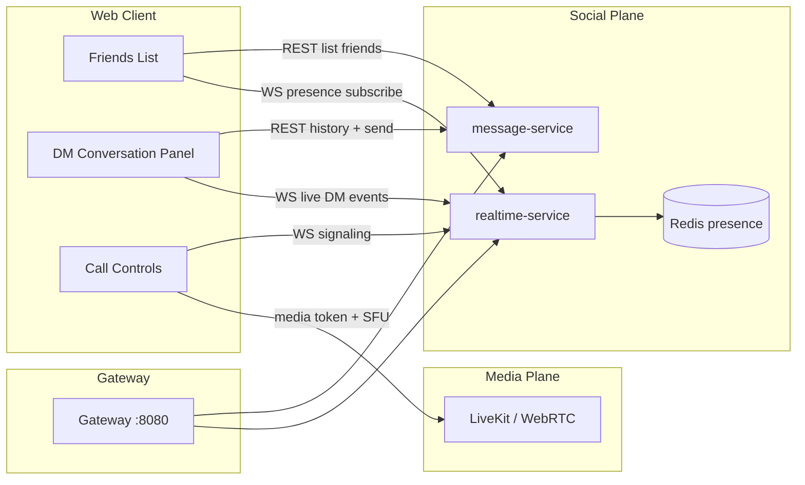

# Social Hub And DM Voice Architecture

Date: 2026-06-17  
Status: planned (post Education MVP core slices)  
Tracking: GitHub issues #31 (Friends Hub) and #32 (DM Voice)

## Context

Issue #15 delivers the **backend contract** for Friend Requests, friendship checks, blocks, and durable Direct Messages over REST. The current frontend panel is a **manual demo harness**—not the product UX learners expect from Discord.

The product direction is a familiar social surface:

- A **Friends list** showing accepted friends with online/offline (and later idle/DND) status.
- Selecting a friend opens a **DM conversation panel** with history and a message composer.
- Friends can **call each other** with 1:1 voice after friendship and block checks pass.

Education deployments still treat Course Channels, Support Questions, TA Queue, and Office Hours as the primary learning-support paths. Social messaging remains platform-wide and separate from course workflows.

## What Exists Today (#15 MVP slice)

| Capability | Transport | Notes |
|---|---|---|
| Send / accept / decline Friend Request | REST → PostgreSQL | `message-service` |
| Send / list Direct Messages | REST → PostgreSQL | Pull-based; no live delivery |
| Block user | REST → PostgreSQL | Blocks DMs |
| Voice Channel join/leave | REST → PostgreSQL | Presence flags only; no audio (#14) |

There is **no** `realtime-service`, **no** WebSocket fan-out, **no** global online presence, and **no** WebRTC/LiveKit media path yet.

## Target Experience

### Friends Hub (#31)

**Friends list**

- Lists accepted friends for the signed-in user (not pending requests—that stays in a separate inbox or badge).
- Each row shows display name, avatar, and presence pill: `online`, `idle`, `offline` (MVP); `dnd` later if needed.
- Row actions: open DM, start voice call (enabled after #32).

**DM conversation panel**

- Selecting a friend loads paginated history from `GET /api/v1/direct-messages`.
- Composer sends via existing `POST /api/v1/direct-messages` (or a realtime-acknowledged variant later).
- New messages from the peer arrive over WebSocket without manual refresh.
- Optimistic send + reconciliation on failure matches channel chat patterns in `plan.md` Milestone 3.

**Presence**

- `realtime-service` tracks WebSocket connections and heartbeats in Redis.
- On connect/disconnect/idle timeout, publish `UserPresenceChanged` to friend subscribers.
- Presence is **platform-wide**, distinct from Voice Channel presence in `community-service` (#14).

### DM Voice (#32)

**Not WebRTC inside Spring.** Audio uses a dedicated media plane (LiveKit or equivalent), same direction as Voice Channel audio transport.

Flow:

1. Caller clicks **Call** on a friend (from list or DM header).
2. `realtime-service` sends call invite signaling to callee over WebSocket.
3. Both clients request a short-lived LiveKit token from a new media/signaling endpoint after `message-service` confirms friendship and no block.
4. Clients join a private 1:1 LiveKit room; hang up tears down room and updates call state.
5. Decline, busy, timeout, and block scenarios return explicit UX states.

DM voice reuses friendship/block rules from `SocialMessagingService`; it does not bypass #15 authorization.

## Service Boundaries

| Concern | Owner |
|---|---|
| Friend graph, blocks, DM persistence | `message-service` (today) |
| Friends list query, conversation metadata | `message-service` (extend) or future `user-service` profile graph |
| WebSocket connections, DM fan-out, call signaling | `realtime-service` (new) |
| Global online presence | `realtime-service` + Redis |
| Voice Channel room presence (#14) | `community-service` (unchanged) |
| Voice Channel + DM media tokens | new `media-signaling` slice or `realtime-service` adjunct + LiveKit |
| Auth principal on all paths | #30 |

## Delivery Phases (recommended order)

| Phase | Slice | Effort | Depends on |
|---|---|---|---|
| A | Finish #15 REST + demo harness | done on branch | — |
| B | Bootstrap `realtime-service` (WS auth, reconnect, Redis presence) | medium | #30 |
| C | **#31 Friends Hub** — list, presence, DM panel, live DM delivery | medium–large | #15, B |
| D | Voice Channel WebRTC/LiveKit transport (Study Server voice rooms) | large | #14, B |
| E | **#32 DM Voice** — 1:1 call signaling + media | large | #31, D |

Phases C and D can overlap once realtime bootstrap lands, but **DM voice should not ship before friendship-aware signaling and a proven WebRTC path** for Voice Channels.

## Effort Summary

| Work | Rough scope | Why |
|---|---|---|
| Friends list + DM UI only (no live updates) | small | Mostly frontend on top of #15 REST; still not Discord-like |
| **#31 full Friends Hub** | **medium–large** | New realtime service, presence store, WS subscriptions, conversation UX, tests |
| **#32 DM Voice** | **large** | Signaling, media tokens, LiveKit ops, call state machine, block/busy edge cases |

#15 is intentionally a **thin vertical slice**. The Discord-like surface is **not** a small follow-up—it is a deliberate second wave after Education MVP messaging infrastructure (#16+) and auth hardening (#30), but it is **well bounded** across two issues.

## Non-Goals (this architecture)

- Group DM calls or server-wide voice migration into DMs.
- SMS/phone PSTN bridging.
- Recording DM voice by default (education consent policies would be a separate decision).
- Replacing Course Channel or Office Hours workflows with friend DMs.

## References

- `docs/product/education-mvp-prd.md` — product scope and testing decisions
- `docs/issues/education-mvp-issue-breakdown.md` — issue tracker
- `plan.md` Milestone 3 (real-time messaging) and Milestone 8 (LiveKit)
- `docs/operations/issue-14-change-log.md` — voice presence vs audio transport
- `docs/operations/issue-15-change-log.md` — current DM backend slice
