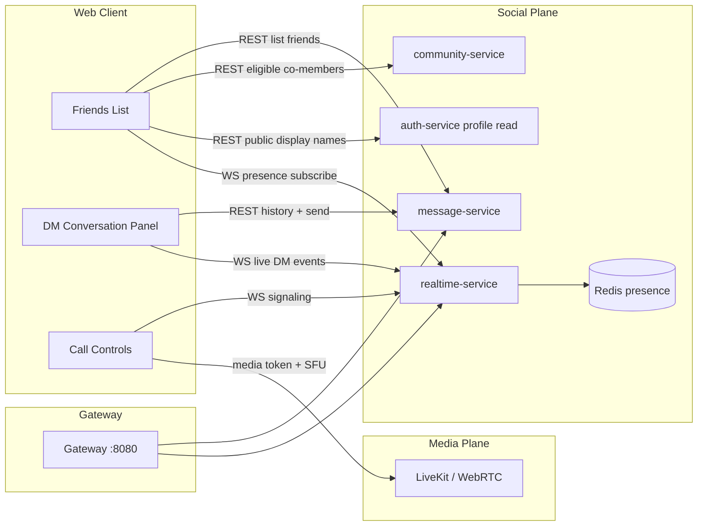

# Social Hub And DM Voice Architecture

Date: 2026-07-13

Status: implemented (#31, #32, and UI v2 operationalization #109)

Tracking: GitHub [project #4](https://github.com/users/Vinosaamaa/projects/4), milestone [Workable Product](https://github.com/Vinosaamaa/chanter/milestone/4), and Public Launch issue [#109](https://github.com/Vinosaamaa/chanter/issues/109). Agent workflow: [`docs/operations/agent-workflow.md`](../operations/agent-workflow.md).

> **Target UX mockups:** [`docs/product-design/mockups/friends-hub-dm.png`](../product-design/mockups/friends-hub-dm.png), [`friend-requests.png`](../product-design/mockups/friend-requests.png). Product index: [`docs/product-design/README.md`](../product-design/README.md).

## Context

Issue #15 established the backend contract for Friend Requests, friendship checks, blocks, and durable Direct Messages. Issues #31 and #32 added the Friends Hub, realtime presence/DM delivery, and LiveKit voice. Issue #109 connects those capabilities to the approved v2 Friends surface and adds privacy-scoped discovery and public display-name reads.

The implemented product surface provides:

- A **Friends list** showing accepted friends with online/offline (and later idle/DND) status.
- Selecting a friend opens a **DM conversation panel** with history and a message composer.
- Friends can **call each other** with 1:1 voice after friendship and block checks pass.

Education deployments still treat Course Channels, Support Questions, TA Queue, and Office Hours as the primary learning-support paths. Social messaging remains platform-wide and separate from course workflows.

**Visibility model:** the Friends list and DMs are **global**; course workspace and cohort rosters are **enrollment-scoped** (learners see only their courses in the sidebar). Friend requests should require **co-membership** in at least one Study Server. See [`docs/product-design/visibility-and-social-model.md`](../product-design/visibility-and-social-model.md) and v2 UI shell [`DESIGN-DECISIONS.md`](../product-design/DESIGN-DECISIONS.md).

## Current Implementation

| Capability | Transport | Notes |
|---|---|---|
| Send / accept / decline / cancel Friend Request | REST → PostgreSQL | `message-service`; send enforces Community co-membership |
| List accepted Friends and blocked users | REST → PostgreSQL | `message-service` |
| Discover eligible co-members | REST → PostgreSQL | `community-service`; canonical membership only |
| Resolve public display names | authenticated batch REST | Interim `auth-service` read boundary; ID + display name only |
| Send / list Direct Messages | REST + WebSocket fan-out | Durable in `message-service`, live delivery through `realtime-service` |
| Global Friend presence | WebSocket + Redis | `realtime-service` |
| DM voice | WebSocket signaling + LiveKit | Friendship/block authorized |

The v2 Friends page uses these live boundaries. Unsupported video calls, DM attachments, and emoji picking remain visibly disabled until their owning slices exist.

## Implemented Experience

### Friends Hub (#31)

**Friends list**

- Lists accepted friends for the signed-in user (not pending requests—that stays in a separate inbox or badge).
- Each row shows display name, avatar, and `online`/`offline` presence; `idle` and `dnd` remain later states.
- Optional context badge for shared Study Server / course (display only).
- Row actions: open DM, start voice call (enabled after #32).
- **Friend requests:** only between users who share at least one Study Server membership (co-membership check via `community-service`).

**DM conversation panel**

- Selecting a friend loads durable history from `GET /api/v1/direct-messages`.
- Composer sends through `POST /api/v1/direct-messages` and reconciles the returned message with history.
- New messages from the peer arrive over WebSocket without manual refresh.
- Optimistic send + reconciliation on failure matches channel chat patterns in `plan.md` Milestone 3.

**Presence**

- `realtime-service` tracks WebSocket connections and heartbeats in Redis.
- On connect/disconnect/idle timeout, publish `UserPresenceChanged` to friend subscribers.
- Presence is **platform-wide**, distinct from Voice Channel presence in `community-service` (#14).

### DM Voice (#32)

**Not WebRTC inside Spring.** Audio uses a dedicated media plane (LiveKit or equivalent), same direction as Voice Channel audio transport.

Flow:

1. Caller clicks **Call** on a friend (from list or DM header).
2. `realtime-service` sends call invite signaling to callee over WebSocket.
3. Both clients request a short-lived LiveKit token from a new media/signaling endpoint after `message-service` confirms friendship and no block.
4. Clients join a private 1:1 LiveKit room; hang up tears down room and updates call state.
5. Decline, busy, timeout, and block scenarios return explicit UX states.

DM voice reuses friendship/block rules from `SocialMessagingService`; it does not bypass #15 authorization.

## Service Boundaries

| Concern | Owner |
|---|---|
| Friend graph, blocks, Friends list, conversation metadata | `message-service` |
| Eligible co-member discovery | `community-service` |
| Display name lookup | interim `auth-service`; future `user-service` profile read model |
| WebSocket connections, DM fan-out, call signaling | `realtime-service` |
| Global online presence | `realtime-service` + Redis |
| Voice Channel room presence (#14) | `community-service` (unchanged) |
| Voice Channel + DM media authorization/tokens | `community-service`, exposed for DM calls through `realtime-service`, plus LiveKit |
| Auth principal on all paths | JWT principal foundation from #30 |

## Delivery Phases

| Phase | Slice | Effort | Depends on |
|---|---|---|---|
| A | Finish #15 REST foundation | done | — |
| B | Bootstrap `realtime-service` (WS auth, reconnect, Redis presence) | done | #30 |
| C | **#31 Friends Hub** — list, presence, DM panel, live DM delivery | done | #15, B |
| D | Voice Channel WebRTC/LiveKit transport (Study Server voice rooms) | done | #14, B |
| E | **#32 DM Voice** — 1:1 call signaling + media | done | #31, D |
| F | **#109 UI v2 operationalization** — co-member discovery, profiles, requests, exact DM context | done locally | #31, #32, #126 |

The implementation preserves the ordering constraint: DM voice uses friendship-aware signaling and the proven LiveKit media path.

## Public Read Contracts (#109)

- `GET /api/v1/social/co-members` returns only peer IDs sharing a canonical Study Server membership with the authenticated viewer and one shared Study Server name.
- `POST /api/v1/auth/profiles/query` accepts at most 100 IDs and returns only known `userId`/`displayName` pairs. It never returns email or authentication data.
- `GET /api/v1/user-blocks` returns the authenticated viewer's blocked user IDs.
- Friend Request writes remain in `message-service`; its existing Community co-membership check is the authorization boundary for sending.

Frontend authenticated query data is cleared on account change/sign-out, and viewer-dependent Study Server/navigation query keys include the user ID to prevent cross-account cache reuse.

## Historical Effort Summary

| Work | Rough scope | Why |
|---|---|---|
| Friends list + DM UI only (no live updates) | small | Mostly frontend on top of #15 REST; still not Discord-like |
| **#31 full Friends Hub** | **medium–large** | New realtime service, presence store, WS subscriptions, conversation UX, tests |
| **#32 DM Voice** | **large** | Signaling, media tokens, LiveKit ops, call state machine, block/busy edge cases |

#15 was intentionally a thin vertical slice. The completed Discord-like surface followed as a deliberate second wave after Education MVP messaging infrastructure and auth hardening.

## Non-Goals (this architecture)

- Group DM calls or server-wide voice migration into DMs.
- SMS/phone PSTN bridging.
- Recording DM voice by default (education consent policies would be a separate decision).
- Replacing Course Channel or Office Hours workflows with friend DMs.

## References

- `docs/product/education-mvp-prd.md` — product scope and testing decisions
- `docs/issues/education-mvp-issue-breakdown.md` — issue tracker
- `plan.md` Milestone 3 (real-time messaging) and Milestone 8 (LiveKit)
- `docs/operations/issue-14-change-log.md` — voice presence vs audio transport
- `docs/operations/issue-15-change-log.md` — current DM backend slice
- `docs/operations/issue-109-change-log.md` — v2 discovery, profile, relationship, and browser verification slice
