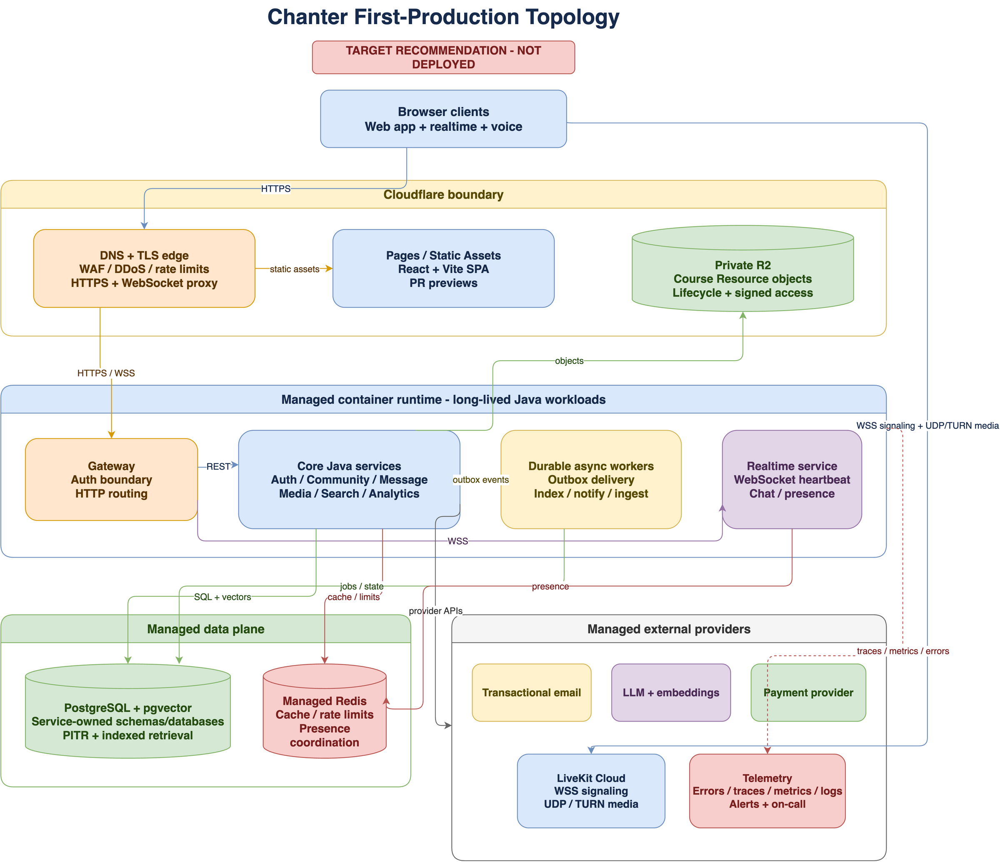

# Chanter Product Readiness Audit

**Date:** 2026-08-09
**Repository baseline:** `main` at `cae62f0`
**Tracking:** [#107](https://github.com/Vinosaamaa/chanter/issues/107), audit [#238](https://github.com/Vinosaamaa/chanter/issues/238)
**Verdict:** **Not product-ready. Strong local beta; no verified public deployment.**

## Executive verdict

Chanter has substantial working product code: a coherent course-first UI, Java 21 service modules, local Docker infrastructure, role-aware education flows, realtime chat/voice foundations, and broad unit coverage. Clean backend and frontend test/build gates pass.

That is not yet a public product. The audit reproduced authorization failures for an invited Study Server Member/Learner, a cross-account redirect leak at sign-out, ambiguous authentication controls, and visible unavailable controls. Production email, browser session renewal, durable object storage, administration/moderation, safe and measurable AI, provider-backed billing, coordinated deletion, observability, backups, and deployment are incomplete. `chanter.app` is still a parked GoDaddy page.

The repository must not describe Chanter as publicly launched until [#255](https://github.com/Vinosaamaa/chanter/issues/255) passes against the real production system.

## What product-ready means

Chanter is product-ready only when all of the following are true:

1. Critical owner, instructor, TA, invited-member, learner, moderator, and billing-mode journeys work end to end in production.
2. Authorization is consistent at UI, API, realtime, search, media, AI, and asynchronous-event boundaries.
3. Email verification/password recovery and browser session renewal work without exposing renewable tokens to JavaScript storage.
4. User data is durable, backed up, restorable, exportable, and deletable according to published policy.
5. The AI Study Assistant is grounded, scoped, safe, evaluated, cost-metered, and truthful about uncertainty and provider failure.
6. The public edge, origin, rate limits, secrets, uploads, payment events, and privileged operations are hardened.
7. Operators can detect, investigate, mitigate, roll back, and recover incidents without direct production-database improvisation.
8. Every visible control works or is removed; accessibility, responsive, browser, and performance gates pass.
9. `chanter.app` serves the monitored production release with real TLS, DNS, API, WebSocket, media, email, and provider checks.

## Audit evidence

### Repository and automated gates

| Gate | Result | Evidence / limitation |
|---|---|---|
| Git state | Pass | Clean `main`, synchronized with `origin/main` at `cae62f0` before the audit branch. |
| Backend clean suite | Pass | Java 21 `mvn -B clean test`: all 12 modules succeeded. |
| Frontend lint | Pass | `npm run lint`. |
| Frontend unit tests | Pass | 65 files, 213 tests. |
| Frontend build | Pass with warning | ~1.23 MB minified JS (~332 kB gzip) in one large chunk; ineffective dynamic-import warning. |
| Local product stack | Pass while supervised | Gateway, auth, realtime, LiveKit, and seed checks passed under `make product-supervise`. |
| `make backend-test` | Fail as a trustworthy local gate | Exported `.env` internal token overrides the fixed test-profile token; default Java may be 17 while artifacts require 21. |
| `make product-test` | Fail as a trustworthy local gate | Exported `.env` makes missing-variable tests inherit real values. |
| Signed-in Playwright suite | Fail | `Password` resolves both input and reveal button; two `Sign in` buttons are semantically indistinguishable. CI runs only shallow public checks. |
| npm production audit | Fail | Two High advisories in the React Router dependency chain at the audited lockfile. Full audit reported eight High advisories including dev tooling. |

### Browser and API audit

An isolated system-Chrome probe signed in as seeded Owner and Learner, traversed Home, Inbox, Calendar, Teaching, Billing, Friends, Course tabs, Community tabs, and 390px mobile Home/Calendar, and captured console, page, request, response, and overflow findings.

Positive results:

- No page exception, failed network request, API 5xx, or horizontal overflow occurred in the completed route pass.
- Desktop Course/People and mobile Calendar rendered coherently at audited dimensions.
- Owner sign-out reached `/sign-in`; the learner could authenticate.

Release blockers found:

1. **Membership contract mismatch:** the accessible Study Server query includes `STUDY_SERVER_MEMBER`, but AI viewer-scope/navigation access omits a generic member with no Course role or Enrollment. The client receives a server ID and then gets 403 from `/{id}/navigation`; `/me/home-summary` fails while aggregating the same inconsistent list. Owner: [#239](https://github.com/Vinosaamaa/chanter/issues/239).
2. **Cross-account redirect leak:** clearing auth while on a protected Owner route lets `ProtectedRoute` first preserve that route in `location.state.from`. The next Learner login returns to the Owner's prior route and triggers stale/unauthorized requests. Owner: [#240](https://github.com/Vinosaamaa/chanter/issues/240).
3. **Auth semantics:** nested password markup gives the input the accessible name `Password Show password`; auth mode and submit controls both expose `Sign in` as buttons. Owner: #240.
4. **Visible unavailable controls:** Billing (`General`, `Members and roles`, `Integrations`, save), Friends/DM (video, file, emoji, empty-send), Course chat/replies, Community member filters, and an unnamed Community lounge control were visibly disabled in audited states. Some input-dependent disabled submits are valid; production placeholders are not. Owner: [#254](https://github.com/Vinosaamaa/chanter/issues/254) plus capability issues.
5. **Loading-state screenshots are not readiness proof:** the initial Owner Home capture still showed loading placeholders because existing E2E asserts route/heading presence before data settles. Owner: [#241](https://github.com/Vinosaamaa/chanter/issues/241).

Audit screenshots and temporary traces were kept outside git under `/tmp/chanter-audit-*.png` and `/tmp/chanter-product-audit-results/`.

### Public deployment and Cloudflare evidence

Verified public state on 2026-08-09:

- `chanter.app` resolves to GoDaddy/DPS parking infrastructure and serves a parked page.
- Authoritative nameservers are `pdns05.domaincontrol.com` and `pdns06.domaincontrol.com`, not Cloudflare.
- The repository has no Wrangler/Cloudflare project configuration, Cloudflare environment variables, or deployed-host manifest.
- Therefore verified repository/public Cloudflare usage is **zero**. Account-level usage and billing are **unknown** because no authenticated Cloudflare account session was available; do not guess it.

## Gap register

### P0: release integrity

| Gap | Why it blocks launch | Owning issue |
|---|---|---|
| Membership/list/navigation/Home disagree | Normal invited-member and learner sessions produce 403s. | [#239](https://github.com/Vinosaamaa/chanter/issues/239) |
| Account switching retains prior route/work | Cross-account state is not isolated. | [#240](https://github.com/Vinosaamaa/chanter/issues/240) |
| CI does not exercise signed-in product | Green checks can miss broken authentication and data journeys. | [#241](https://github.com/Vinosaamaa/chanter/issues/241) |
| Local gates depend on `.env` and ambient JDK | A developer cannot reliably reproduce CI. | #241 |
| Known High dependency advisories | Public production would ship known vulnerable runtime code. | #241 |

### P1: production foundation

| Gap | Current behavior | Owning issue |
|---|---|---|
| Transactional email | `LoggingEmailSender` is the only sender and does not deliver mail; staging docs incorrectly imply usable links appear in logs. | [#242](https://github.com/Vinosaamaa/chanter/issues/242) |
| Browser session renewal | Refresh token is returned in JSON and kept memory-only; access token is persisted. Reload/expiry behavior is not a durable production session. | #242 |
| Real deployment | Prose-only single-VM placeholder; no production OCI images, IaC, deploy/rollback pipeline, or real hostname. | [#243](https://github.com/Vinosaamaa/chanter/issues/243) |
| Course Resource durability/security | Media writes to host-local `./data/course-resources`; MinIO runs but is unused; upload trusts client MIME and has no quarantine/malware scan. | [#244](https://github.com/Vinosaamaa/chanter/issues/244) |
| Derived-data delivery | Notifications are synchronous best-effort HTTP; search refresh is manual; Redpanda runs but has no application producer/consumer. | [#245](https://github.com/Vinosaamaa/chanter/issues/245) |
| Edge/abuse policy | Auth-only in-memory rate limiting, forwarded-IP trust ambiguity, no global AI/upload/message limits, no verified origin protection/CSP baseline. | [#253](https://github.com/Vinosaamaa/chanter/issues/253) |

### P1: product capabilities

| Gap | Current behavior | Owning issue |
|---|---|---|
| AI ingestion | Text/Markdown only; advertised PDF/presentation/audio/video resources do not become reliable grounding. | [#246](https://github.com/Vinosaamaa/chanter/issues/246) |
| Vector retrieval | Hashing embeddings and `BYTEA` vectors are loaded into the JVM and cosine-scanned. | [#247](https://github.com/Vinosaamaa/chanter/issues/247) |
| AI safety/cost/quality | Provider/model defaults can disagree; no full prompt-injection/safety layer or release eval; token usage is parsed but not reliably persisted/enforced. | [#248](https://github.com/Vinosaamaa/chanter/issues/248) |
| Platform administration/moderation | No platform role, report queue, suspend/quarantine workflow, block/report path, or privileged audit log. | [#249](https://github.com/Vinosaamaa/chanter/issues/249) |
| Billing truthfulness | UI explicitly simulates plan changes; an Owner can patch a tier without a payment provider or verified entitlement event. | [#250](https://github.com/Vinosaamaa/chanter/issues/250) |
| Data lifecycle/legal | Study Server deletion is community-local; media/messages/AI/search/notifications can orphan. No account export/delete; legal/support copy uses placeholders. | [#251](https://github.com/Vinosaamaa/chanter/issues/251) |

### P1: operation and customer quality

| Gap | Current behavior | Owning issue |
|---|---|---|
| Observability/recovery | Health endpoints exist, but no end-to-end traces, production exception tracking, SLO alerts, backup automation, or recorded restore drill. | [#252](https://github.com/Vinosaamaa/chanter/issues/252) |
| Dead controls/accessibility/performance | Existing heuristic inventory misses audited placeholders; no WCAG 2.2 AA gate; oversized frontend bundle. | [#254](https://github.com/Vinosaamaa/chanter/issues/254) |
| Public launch proof | Launch checklist is unsigned and all controls/providers/DNS are unverified. | [#255](https://github.com/Vinosaamaa/chanter/issues/255) |

## Recommended production topology

### Keep Cloudflare, but use it at the right boundary

Recommended first-production boundary:

This diagram is a target recommendation, not evidence of a deployed environment. The embedded draw.io source remains editable in the PNG; the standalone source is [`product-readiness-target-deployment.drawio`](../diagrams/product-readiness-target-deployment.drawio).

| Workload | Recommended home | Reason |
|---|---|---|
| DNS, TLS edge, CDN/WAF/DDoS | Cloudflare proxied zone | Appropriate L7 edge protection and cache controls. |
| React/Vite static frontend | Cloudflare Pages or Workers Static Assets | Static asset requests are free/unlimited on Pages; previews are useful for PRs. |
| Course Resource objects | Private Cloudflare R2 | S3-compatible, strong object semantics, free egress, lifecycle controls; application still authorizes access. |
| Spring Boot services/gateway | Conventional managed container runtime | Long-lived JVM services need predictable container lifecycle, private service networking, probes, and autoscaling. |
| PostgreSQL + vectors | Managed PostgreSQL with `pgvector` | Existing JDBC/Flyway model, PITR, and server-side scoped vector search. Do not rewrite to D1 for launch. |
| Redis | Managed Redis-compatible service | Shared rate limits, cache, presence/ephemeral coordination. |
| Voice/media plane | LiveKit Cloud initially | WebRTC needs public UDP/TURN and operational expertise; ordinary Cloudflare HTTP proxying is not the media plane. |
| Email / payments / AI | Managed providers behind server adapters | Deliverability, compliance surface, webhook verification, model quality, and operational ownership. |
| Telemetry | Managed error/trace/metric/log destinations | Faster path to alerts, retention, and on-call evidence than self-hosting an observability stack. |

Cloudflare supports proxied WebSockets for realtime signaling, but connections may be restarted and need heartbeat/reconnect logic. Its normal HTTP proxy covers a fixed set of TCP ports, not LiveKit's UDP media plane. Cloudflare Spectrum can proxy arbitrary UDP only as an Enterprise paid add-on, so it is not the economical launch path for voice.

Cloudflare Containers are generally available and can run JVM images, but the current platform has no built-in stateless autoscaling, uses ephemeral container disk, and does not guarantee an individual instance's continuous lifetime. It is a candidate to benchmark in #243, not the default place to move ten stateful-operational service processes without a deployment proof.

Official references:

- [Cloudflare WebSockets](https://developers.cloudflare.com/network/websockets/)
- [Cloudflare network ports](https://developers.cloudflare.com/fundamentals/reference/network-ports/)
- [Spectrum protocols by plan](https://developers.cloudflare.com/spectrum/protocols-per-plan/)
- [Pages pricing](https://developers.cloudflare.com/pages/functions/pricing/)
- [R2 pricing](https://developers.cloudflare.com/r2/pricing/)
- [Cloudflare Containers FAQ](https://developers.cloudflare.com/containers/faq/)
- [LiveKit production deployment](https://docs.livekit.io/transport/self-hosting/deployment/)

### Initial cost posture

- Pages static requests are currently free and unlimited.
- R2 Standard currently includes 10 GB-month, 1 million Class A operations, and 10 million Class B operations monthly; Standard storage above the free tier is currently $0.015/GB-month with free egress.
- Cloudflare Workers Paid currently starts at $5/month; do not move the Java backend to Workers merely to use that price.
- Use free-beta mode until #250 passes; this avoids pretending simulated tiers are revenue infrastructure.
- Set billing alerts before live AI, email, media, database, and container providers receive production traffic.

Prices and limits are time-sensitive and must be rechecked during #243/#255.

## Architecture and scope decisions

1. Preserve the existing education domain and service-owned data boundaries during launch hardening; do not begin a speculative rewrite.
2. Reduce operational waste where evidence is clear: remove unused Redpanda/MinIO from production unless #245/#244 give each an owning path.
3. Use a transactional outbox before adding more synchronous cross-service fan-out.
4. Keep creator Course storefront commerce deferred. Product-ready initial monetization is Study Server SaaS billing (#250), not marketplace/tax/payout scope.
5. Hide or remove unavailable features when they are not required for launch; no visible dead control survives #254.
6. Update `System Design.md` only when #243/#245/#244 implementation changes the deployed architecture. This audit recommends a target but does not claim it is deployed.

## Ordered remediation program

The canonical dependency order is in [`product-readiness-issue-breakdown.md`](../issues/product-readiness-issue-breakdown.md):

`#238 -> #239 -> #240 -> #241`, then production foundation and capabilities, then `#252/#253/#254 -> #255`.

Each issue follows one issue -> one branch -> one PR -> local gates -> browser gates where applicable -> CI -> CodeAnt (up to three remediation rounds) -> gated agent merge. Direct pushes to `main` remain forbidden.

## Audit limitations

- Cloudflare account-level products/usage/billing were not visible without an authenticated account session.
- No real staging/production provider account was provisioned, so live email, payment, AI, LiveKit, backup, and rollback behavior remains unverified by definition.
- The browser audit used seeded local data and read-oriented route traversal. Mutation, two-browser realtime, voice audio, provider, recovery, load, and destructive lifecycle tests belong to their owning issues.
- Dependency advisories and vendor pricing can change; release gates must refresh them rather than copy this audit indefinitely.
