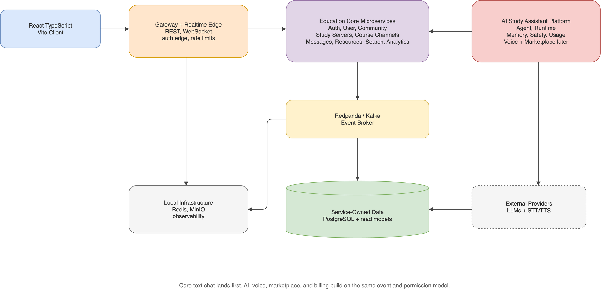
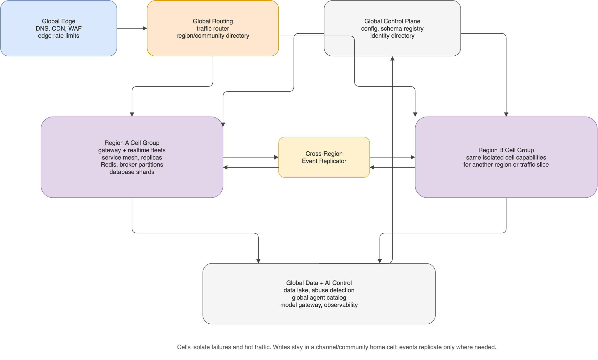
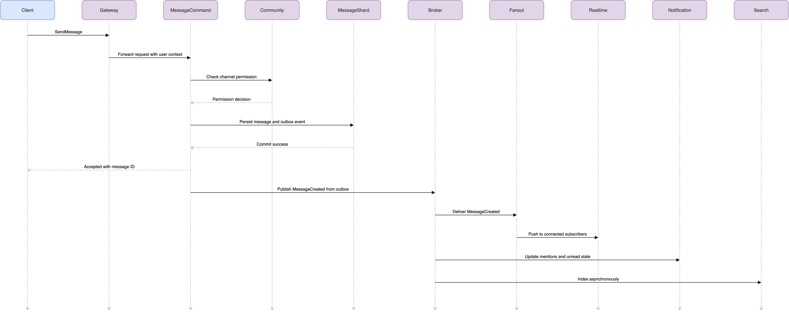
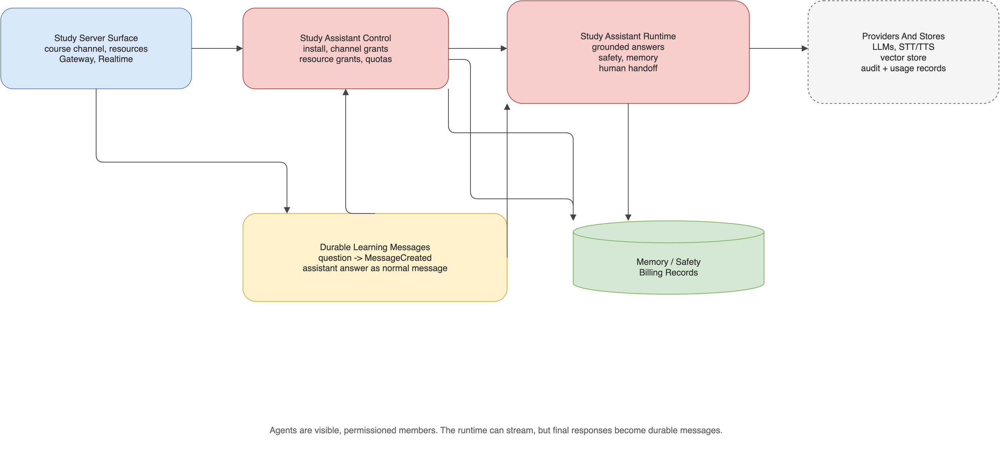

# Production Discord-like App Plan

## Target Architecture

We will build a production-oriented microservice system with Spring Boot services, a React + TypeScript + Vite frontend, PostgreSQL for durable service-owned data, Redis for cache/presence/rate-limit state, object storage for uploads, and Docker Compose for local production-like deployment.

The backend will not be a monolith. Each major business capability will be isolated behind its own Spring Boot service boundary. Services communicate through synchronous APIs for direct request/response needs and asynchronous domain events for workflows that should not be tightly coupled.

Proposed structure:

- `backend/gateway-service/`: API gateway, routing, edge authentication, rate limiting, request correlation.
- `backend/auth-service/`: registration, login, refresh tokens, password security, sessions.
- `backend/user-service/`: user profiles, status, user settings, avatars metadata.
- `backend/community-service/`: servers, channels, roles, permissions, invites, membership.
- `backend/message-service/`: messages, edits, deletes, reactions, read receipts.
- `backend/realtime-service/`: WebSocket gateway, subscriptions, typing, presence fan-out.
- `backend/notification-service/`: mentions, unread state, notification preferences, delivery state.
- `backend/moderation-service/`: bans, kicks, audit logs, moderation workflows.
- `backend/media-service/`: upload authorization, attachment metadata, file validation, storage access.
- `backend/search-service/`: message/user/channel search read model.
- `backend/analytics-service/`: analytics events, aggregates, admin dashboard read APIs.
- `backend/agent-service/`: installed agents, personas, channel bindings, agent permissions, agent configuration.
- `backend/agent-runtime-service/`: LLM conversation orchestration, provider adapters, tool execution, streaming responses.
- `backend/voice-agent-service/`: voice agent sessions, speech-to-text, text-to-speech, voice channel participation.
- `backend/memory-service/`: opt-in agent memory, summaries, embeddings, retrieval, retention controls.
- `backend/marketplace-service/`: agent listings, creator publishing, installs, reviews, marketplace governance.
- `backend/billing-service/`: usage metering, credits, subscriptions, paid agent purchases, cost controls.
- `backend/safety-service/`: prompt safety, content policy checks, abuse detection, agent evaluation workflows.
- `backend/common/`: shared contracts, error format, tracing utilities, test helpers. This must stay small.
- `frontend/`: React + TypeScript + Vite app, routing, realtime client, UI system, tests.
- `infra/`: Docker Compose, databases, Redis, event broker, local object storage, observability configs.
- `docs/`: architecture decisions, API contracts, runbooks, test strategy.

Editable source: [`plan-target-architecture.drawio`](docs/diagrams/plan-target-architecture.drawio) | PNG export: [`plan-target-architecture.drawio.png`](docs/diagrams/plan-target-architecture.drawio.png)

## Product Positioning

Chanter's first market wedge is education. We are not starting as a generic Discord clone; we are building a Discord-like learning community SaaS product for educators, bootcamps, tutoring businesses, cohort-based course creators, and large study groups.

Positioning:

> Discord for learning communities, with AI teaching assistants and instructor operations built in.

The initial product is a Study Server: a realtime learning community with course/module channels, roles, course resources, an AI Study Assistant, office-hours workflows, FAQ generation, learning summaries, and instructor analytics. The marketplace, voice agents, and broader enterprise learning features remain later phases after the first-party education workflow is trusted.

Later monetization direction: creator course commerce. After Study Servers prove useful, instructors should be able to sell courses inside a Study Server, let learners purchase/enroll, unlock course channels/resources/live classes automatically, and keep community support in the same product. This would move Chanter toward a community-native course platform: Discord-like community, AI-assisted learning operations, live classes, and Udemy/Circle/Skool-style course sales in one place.

Market reality:

- Discord is the better choice for casual free chat, gaming/social communities, and groups that do not need structured learning operations.
- Chanter only has a strong business case if it solves buyer pain for educators: repeated questions, buried course knowledge, office-hour logistics, weak analytics, fragmented resources, and unsafe/uncontrolled bots.
- The first product should sell outcomes, not novelty: lower instructor/TA workload, faster learner support, reusable course knowledge, safer AI assistance, and clearer instructor visibility.
- Do not compete head-on as a consumer social network. Compete as a paid learning community operations layer with Discord-like familiarity.
- A later course-commerce layer can make the business stronger by letting instructors sell courses, run live classes, and manage learner community/support in one place. This should come after the education MVP because payments, refunds, taxes, creator trust, fraud, and live-video reliability add significant scope.

Identity direction:

- Users have global accounts.
- Organizations/workspaces are optional at first and become important for schools, bootcamps, and larger course businesses.
- Roles are scoped to each Study Server: owner, instructor, TA, learner, alumni, and guest.
- A user can be an instructor in one Study Server and a learner in another.
- Instructor powers are assigned by Study Server admins or organization policy, not by self-declaration.
- Friend requests and DMs can exist later, but education deployments need consent, block/report controls, and policy settings for student-teacher messaging.

Supporting planning docs:

- `docs/product-design/` — **product showcase**: target browser UI mockups, `vision.md`, `visibility-and-social-model.md`, user-journey diagram, interactive screen tour (`README.md` is the index)
- `docs/product/education-mvp-prd.md`
- `docs/issues/education-mvp-issue-breakdown.md`
- `CONTEXT.md` — canonical glossary

## Product Scope

The expanded local version will be built in phases so each feature lands with tests and a working demo path. The first demo path should prove an education workflow, not just generic chat: an educator creates a Study Server, learners ask course questions, the AI Study Assistant answers from approved resources, low-confidence questions route to human help, and instructors see useful dashboard insights.

Phase 1: Core foundation

- User registration, login, refresh tokens, password hashing, session lifecycle.
- Study Server creation, membership, invites, instructor/TA/learner roles, and permissions.
- Course/module text channels with message create/edit/delete, read state, typing indicators, and presence.
- Local Docker Compose environment for app, PostgreSQL, Redis, and storage.

Phase 2: Production chat behavior

- Real-time chat over WebSocket using authenticated subscriptions.
- Message pagination, optimistic UI, reconnect handling, and idempotent sends.
- Moderation basics: kick/ban, role-gated channels, message deletion audit trail.
- Notification model: mentions, unanswered questions, unread counts, channel/server badges.

Phase 3: Education operations

- Course resource uploads through backend-issued object storage flow with type/size validation hooks and explicit AI-approved status.
- Search across course resources, approved FAQs, summaries, and relevant messages. Start with PostgreSQL full-text search locally; keep the boundary ready for OpenSearch later.
- Question workflow: unanswered, answered, duplicate, FAQ candidate, and human handoff states.
- Office-hours queue and TA handoff workflow.
- Instructor analytics dashboard: unanswered questions, repeated questions, common misconceptions, engagement trends, AI usage, and office-hours load.

Phase 4: AI Study Assistant

- First-party AI Study Assistant that can be installed into selected Study Server channels.
- Agent-as-member model: the assistant has a visible profile, role, permission grants, channel access, and audit trails.
- Grounded answers from approved course resources, approved FAQs, and allowed recent context.
- Low-confidence handoff to office hours or instructor/TA review.
- FAQ generation, weekly study summaries, and misconception detection.
- Usage metering and SaaS plan quota enforcement.
- Course commerce, live classes, voice agent, and marketplace later: paid course listings, live cohorts, installable personas, specialized assistants, voice packs, prompt packs, tool integrations, reviews, and paid agents.

## Backend Microservice Design

Use Spring Boot 3, Java 21, Spring Security, Spring Data JPA, Flyway, PostgreSQL, Redis, WebSocket/STOMP, an event broker, OpenAPI, and Testcontainers.

The default local event broker should be Redpanda or Kafka-compatible infrastructure. Redpanda is easier for local Docker Compose because it avoids ZooKeeper and keeps the development environment lighter while preserving Kafka-compatible production patterns.

Service boundaries:

- Gateway Service: owns public REST routing, CORS, rate limiting, request correlation, edge token validation, and OpenAPI aggregation.
- Auth Service: owns credentials, refresh token rotation, password hashing, login/logout, session revocation, auth audit events.
- User Service: owns user profile data, display names, avatars metadata, user settings, account status.
- Community Service: owns servers, channels, membership, roles, permissions, invites, and permission evaluation APIs.
- Message Service: owns message persistence, edit/delete history, reactions, read receipts, message pagination, idempotent send keys.
- Realtime Service: owns WebSocket connections, STOMP topics, subscription authorization, presence, typing indicators, and live fan-out.
- Notification Service: owns mentions, unread counts, notification preferences, inbox state, delivery state.
- Moderation Service: owns bans, kicks, warnings, report queues, moderation audit records, policy enforcement workflows.
- Media Service: owns upload sessions, attachment metadata, file validation policy, object storage access, signed download authorization.
- Search Service: owns denormalized search indexes for messages, channels, users, and servers.
- Analytics Service: owns analytics event ingestion, aggregates, admin dashboard read models, usage metrics.
- Agent Service: owns agent definitions, personas, server installs, channel bindings, permissions, model settings, and agent lifecycle.
- Agent Runtime Service: owns LLM orchestration, prompt assembly, provider routing, tool calls, streaming text responses, and conversation state.
- Voice Agent Service: owns voice agent sessions, speech-to-text, text-to-speech, live voice response coordination, and voice room participation.
- Memory Service: owns opt-in long-term memory, channel summaries, embeddings, retrieval, retention policy, and user/admin deletion workflows.
- Marketplace Service: owns agent listings, creator publishing, reviews, installs, versioning, and marketplace moderation.
- Billing Service: owns token/credit metering, paid installs, subscriptions, invoices, quotas, budget limits, and provider cost attribution.
- Safety Service: owns AI safety checks, prompt-injection detection, content filtering, model output review hooks, abuse signals, and evaluation records.

Microservice rules:

- Each service owns its data. Other services cannot directly query another service's database.
- Cross-service writes happen through the owning service's API or through domain events.
- Read-heavy screens may use denormalized read models built from events.
- Shared code must be limited to stable contracts and infrastructure helpers; business logic should not live in `backend/common/`.
- Service APIs must publish OpenAPI contracts.
- Service events must publish versioned schemas.
- Every service has independent Flyway migrations.
- Every service exposes health, readiness, metrics, and structured logs.

Core communication patterns:

- Browser to backend: HTTPS through Gateway Service.
- Browser to live updates: WebSocket to Realtime Service.
- Service to service synchronous calls: internal REST clients only when immediate data is required.
- Service to service asynchronous workflows: domain events over the event broker.
- Cache and ephemeral state: Redis for sessions/rate limits/presence/typing, not as the source of truth.

Important event examples:

- `UserRegistered`
- `UserProfileUpdated`
- `ServerCreated`
- `MemberJoinedServer`
- `RoleChanged`
- `ChannelCreated`
- `MessageCreated`
- `MessageEdited`
- `MessageDeleted`
- `ReactionAdded`
- `AttachmentUploaded`
- `MentionDetected`
- `ModerationActionCreated`
- `AgentInstalled`
- `AgentRemoved`
- `AgentInvoked`
- `AgentResponseCreated`
- `AgentToolCalled`
- `AgentMemoryCreated`
- `AgentMemoryDeleted`
- `VoiceAgentJoined`
- `VoiceAgentTranscriptCreated`
- `MarketplaceAgentPublished`
- `AgentPurchaseCompleted`

Key backend standards:

- Each service follows controller -> application service -> domain service -> repository where useful.
- Permission checks are centralized in Community Service, but enforcement still happens at the service performing the protected action.
- Services use explicit transaction boundaries at application service methods.
- Public API errors use Problem Details.
- Event consumers must be idempotent.
- Message creation must support idempotency keys to avoid duplicate sends after reconnects.
- Service-to-service calls must have timeouts, retries where safe, and circuit breakers.
- Distributed tracing must propagate correlation IDs across gateway, services, events, and WebSocket flows.

## Frontend Design

Use React + TypeScript + Vite with React Router, TanStack Query, a lightweight state store such as Zustand, and a component library strategy we can choose during implementation.

**Product UI reference (for agents and designers):** [`docs/product-design/README.md`](docs/product-design/README.md) — 19 concept mockups, screen flows, and `vision.md`. **Visibility:** global Friends Hub + enrollment-scoped **My courses** sidebar — [`visibility-and-social-model.md`](docs/product-design/visibility-and-social-model.md). Delivery is a **browser web app** (not a native desktop app for MVP). The running `frontend/` code is still a vertical-slice API demo until Milestone 3 realtime shell lands.

Core frontend areas:

- Auth screens and protected route shell.
- Server/channel sidebar layout similar to Discord, with **My courses** filtered by enrollment and role (not a full server catalog for learners).
- Global Friends Hub (separate from server shell) with co-membership-gated friend requests (#31).
- Message timeline with virtualization, optimistic sending, edit/delete, attachments, mentions.
- WebSocket client with reconnect, resubscribe, and event reconciliation.
- Role and permission-aware UI.
- Study Server creation and course/module channel management.
- Course resource library, approved FAQ, question workflow, and office-hours queue UI.
- Instructor analytics screens for unanswered questions, repeated questions, misconceptions, engagement, office-hours load, and AI usage.
- AI Study Assistant install/config screens, channel agent controls, usage/cost indicators, and memory management UI.
- Marketplace browsing later after the first-party Study Assistant is trusted.
- Error boundaries, loading skeletons, empty states, and accessible keyboard navigation.

Frontend standards:

- TypeScript strict mode.
- API client generated from OpenAPI or strongly typed manually at first.
- Feature-based folders rather than one giant components folder.
- Form validation with shared schemas where useful.
- No business-critical permission decisions only in the UI; backend remains authoritative.

## Data Model Direction

Initial service-owned relational entities:

- Auth Service: UserCredential, UserSession, RefreshToken, LoginAttempt, AuthAuditEvent
- User Service: UserProfile, UserSettings, UserAvatar, UserStatus
- Community Service: Server, ServerMember, Invite, Channel, ChannelPermissionOverride, Role, MemberRole
- Message Service: Message, MessageEdit, MessageReaction, ReadReceipt, MessageAttachmentReference
- Notification Service: Notification, Mention, UnreadState, NotificationPreference
- Realtime Service: PresenceState, WebSocketSession, TypingState
- Moderation Service: ModerationAction, Ban, Kick, Warning, Report, AuditLogEvent
- Media Service: UploadSession, Attachment, FileValidationResult, StorageObject
- Search Service: MessageSearchDocument, UserSearchDocument, ChannelSearchDocument
- Analytics Service: AnalyticsEvent, DailyServerMetric, DailyChannelMetric, ActiveUserMetric
- Education MVP concepts across owning services: StudyServer, CourseModuleChannel, CourseResource, QuestionThread, QuestionState, FaqEntry, OfficeHoursQueue, OfficeHoursQueueItem, MisconceptionSignal, InstructorInsight
- Agent Service: AgentDefinition, AgentPersona, AgentInstall, AgentChannelBinding, AgentPermissionGrant, AgentModelConfig, StudyAssistantInstall
- Agent Runtime Service: AgentConversation, AgentInvocation, AgentRun, AgentToolCall, AgentResponse, GroundedAnswerAttempt
- Voice Agent Service: VoiceAgentSession, VoiceTranscriptSegment, VoiceResponse, VoiceParticipantState
- Memory Service: AgentMemory, ChannelSummary, MemoryEmbedding, MemoryRetentionPolicy, MemoryDeletionRequest
- Marketplace Service: AgentListing, AgentVersion, CreatorProfile, AgentReview, MarketplaceInstall
- Billing Service: UsageMeter, CreditBalance, Subscription, Invoice, ProviderCostRecord, BudgetLimit, StudyServerPlan, AiUsageQuota
- Later course-commerce data: CourseListing, CourseEnrollment, CoursePurchase, CourseAccessGrant, LiveClassSession, LiveClassRecording, CreatorPayout, RefundRequest
- Safety Service: SafetyReview, PromptInjectionSignal, ContentPolicyDecision, AgentEvaluationResult

Design choices:

- Use UUIDs for public identifiers.
- Store timestamps consistently in UTC.
- Soft-delete messages where audit/moderation requires history.
- Keep attachments as metadata in PostgreSQL and binary files in object storage.
- Keep permission evaluation centralized, versioned, and unit-tested.
- Avoid cross-database joins. Use APIs, events, or read models instead.
- Accept eventual consistency for notifications, search, analytics, and some profile display fields.
- Require strong consistency for authentication, permission checks, membership, channel access, and message writes.
- Treat agents as permissioned members, not hidden system processes. If an agent can read a channel, users should be able to see that.
- Agent memory must be opt-in, scoped, auditable, and deletable by authorized users.
- Agent marketplace installs must record listing version, requested permissions, pricing state, and safety review status.

## Local Deployment Plan

Local production-like deployment will use Docker Compose:

- PostgreSQL instances or schemas per service
- Redis
- Redpanda or Kafka-compatible event broker
- MinIO or local S3-compatible object storage
- Optional local LLM provider through Ollama for development, with provider adapters for hosted LLMs later
- Optional LiveKit or equivalent WebRTC media server for voice agent experiments
- Spring Boot microservices
- Gateway Service
- React frontend served through Nginx or Vite dev mode for development
- Optional observability stack later: Prometheus, Grafana, Loki or OpenTelemetry collector

Developer commands should eventually include:

- `docker compose up --build`
- backend test command
- frontend test command
- database migration command
- seed/demo data command

## Testing Strategy

Backend tests:

- Unit tests for permission evaluation, auth token logic, message validation, notification rules.
- Integration tests with Spring Boot + Testcontainers for repositories, REST APIs, WebSocket events, broker events, and Flyway migrations.
- Security tests for unauthorized channel access, expired tokens, role escalation, and upload validation.
- Contract tests for public API response shapes, internal service clients, and versioned event schemas.
- Agent tests for prompt assembly, permission-scoped context access, memory retention, tool authorization, usage metering, and safety decisions.

Frontend tests:

- Unit tests for utilities, permission rendering, reducers/stores, WebSocket event handling.
- Component tests for login, sidebar, message timeline, upload UI, admin dashboard widgets.
- E2E tests with Playwright for signup/login, creating a server, sending messages, role-gated channel access, file upload, search, notifications.
- E2E tests for installing an agent, mentioning an agent in a channel, reviewing requested permissions, deleting memory, and seeing usage limits.
- Accessibility checks for keyboard navigation, focus management, semantic controls, and color contrast.

System tests:

- Docker Compose smoke test: services boot, migrations apply, frontend can login and send a message.
- Load-oriented checks for message send path, broker consumption, and WebSocket fan-out.
- Failure tests for Redis restart, broker restart, WebSocket reconnect, duplicate sends, service timeout, and upload failures.
- AI system tests for provider timeout, provider rate limit, safety rejection, tool failure, duplicate agent invocation, and voice transcript delay.

## Software Development Lifecycle

Use an incremental production workflow:

1. Requirements and acceptance criteria per feature.
2. Architecture decision records for major choices: auth model, realtime protocol, storage, search, voice/video signaling, agent permissions, agent memory, marketplace governance, and LLM provider strategy.
3. API-first design for each backend slice.
4. Implement backend and frontend in vertical slices, not isolated layers.
5. Add automated tests with each slice.
6. **Git:** one GitHub issue → one branch → one pull request → merge to `main` only after owner approval (`docs/operations/project-operations-bootstrap.md`).
7. **TDD** for domain features from issue #12 onward; infra/bootstrap may use smoke tests only.
8. Run local Docker smoke tests before considering a feature done.
9. Review security, performance, observability, and migration impact before release.
10. Maintain release notes, change logs, debug logs, and runbooks for local deployment.
11. For every non-trivial implementation slice, add an issue-scoped change log under `docs/operations/` with the files changed, behavior added, verification commands, and representative code snippets.
12. For every meaningful local or browser-debugging failure, add an issue-scoped debug log under `docs/operations/` with symptoms, hypotheses, commands run, findings, fixes, and final verification.
13. For every CodeRabbit suggestion that is fixed or explicitly deferred, add an issue-scoped fix log under `docs/operations/issue-<number>-coderabbit-fix.md` (see `docs/operations/agent-workflow.md`).
14. Do not push after edits or commits unless the user explicitly approves the push as a separate action at push time.

Use installed Cursor workflow skills directly when they fit the task: `grill-with-docs` for doc review, `to-prd` for requirements, `to-issues` for work breakdown, `tdd` for risky implementation logic, `diagnose` for bugs, `zoom-out` or `improve-codebase-architecture` for architecture review, `prototype` for uncertain flows, `setup-pre-commit` for quality gates, and CodeRabbit for PR review loops (`docs/operations/agent-workflow.md`).

Definition of Done for each feature:

- Backend endpoint/service implemented with validation and permissions.
- Frontend UI implemented with loading, error, and empty states.
- Database migrations are reversible or safely forward-only with documented rollback.
- Issue-scoped change log, any relevant debug log, and any relevant CodeRabbit fix log are written under `docs/operations/`.
- Unit/integration tests added.
- E2E coverage added for user-critical flows.
- Logs and metrics added where operationally useful.
- Local Docker path verified.

## Security And Production Readiness

Security controls:

- Secure password hashing.
- JWT access tokens plus refresh token rotation.
- CSRF strategy depending on cookie/token transport decision.
- CORS locked to known origins.
- Rate limiting for auth, invites, message sends, uploads, and search.
- Server-side permission checks for every protected resource.
- Upload limits, MIME validation, file extension validation, and malware scan integration point.
- Audit logs for moderation and role changes.
- Explicit consent and visibility when agents can read a channel or join a voice room.
- Agent memory controls: opt-in, scope boundaries, retention limits, export/delete workflows, and audit logs.
- Prompt-injection and tool-use controls before agents can access files, messages, or administrative actions.
- Usage budgets and rate limits for LLM calls, voice transcription, text-to-speech, and marketplace agents.

Operational controls:

- Structured JSON logs.
- Health checks and readiness probes.
- Metrics for API latency, WebSocket connections, message throughput, auth failures, upload failures.
- Centralized error handling.
- Database migration discipline.
- Environment-based config with no secrets committed.

## Implementation Milestones

Current implementation status as of 2026-06-24:

- **Education MVP backend (milestone 1):** issues **#11–#24** merged on `main`.
- **Active:** **Production Frontend** (milestone 3, [project #3](https://github.com/users/Vinosaamaa/projects/3)) — start at **#48**. See [`docs/operations/agent-workflow.md`](docs/operations/agent-workflow.md).
- **Next:** **Workable Product** (milestone 4, [project #4](https://github.com/users/Vinosaamaa/projects/4)) — after **#51** merges.
- Cross-cutting auth: **#30** (pair with **#49**).
- `frontend/src/App.tsx` remains an API demo until Production Frontend slices land.

Milestone -1: Project operations bootstrap

- Initialize local git when approved.
- Create and connect the GitHub repository.
- Add repository metadata: README, gitignore, PR template, issue templates, and CODEOWNERS later when ownership is real.
- Use GitHub Projects as the first work tracker.
- Convert this plan and `docs/product/education-mvp-prd.md` into epics and vertical-slice stories with acceptance criteria.
- Decide branch naming, commit style, PR requirements, and branch protection rules.
- Add first CI workflow after the project skeleton has runnable checks.

Milestone 0: Project bootstrap

- Create monorepo layout.
- Initialize Spring Boot microservices and React Vite frontend.
- Add Docker Compose with PostgreSQL, Redis, event broker, and object storage.
- Add baseline CI-style scripts locally.

Milestone 1: Auth and identity

- Implement register/login/refresh/logout.
- Add protected frontend routing.
- Add user profile basics.
- Add backend auth tests and frontend auth E2E test.

Milestone 2: Study Servers, course channels, roles

- Create Study Servers and course/module channels.
- Add membership, invites, instructor/TA/learner roles, and permission checks.
- Render Discord-like learning community shell in frontend.
- Add permission unit and integration tests.

Milestone 3: Real-time course messaging

- Add message persistence.
- Add WebSocket subscriptions.
- Add typing indicators, presence, read state.
- Add reconnect and optimistic UI handling.
- Add WebSocket integration and E2E chat tests.

Milestone 4: Course support workflow

- Add question detection and unanswered/answered/duplicate/FAQ-candidate states.
- Add mentions, unread counts, unanswered-question badges, and TA/instructor notifications.
- Add moderation basics: kick/ban, role-gated channels, message deletion audit trail.
- Add support workflow and moderation/security tests.

Milestone 5: Course resources, search, and FAQ

- Add course resource metadata and local object storage.
- Add upload validation, download access checks, and AI-approved resource status.
- Add search across messages, channels, resources, summaries, and approved FAQs.
- Add repeated-question detection and instructor-approved FAQ entries.
- Add resource/search/FAQ E2E tests.

Milestone 6: Office hours and instructor analytics

- Add office-hours queue and TA handoff workflow.
- Add analytics events and aggregate dashboard data.
- Add instructor dashboard for unanswered questions, repeated questions, misconceptions, engagement, office-hours load, and AI usage.
- Add dashboard and office-hours E2E tests.

Milestone 7: AI Study Assistant

- Add Agent Service, Agent Runtime Service, Memory Service, and Safety Service.
- Model the AI Study Assistant as an installable Study Server/channel member with explicit permissions.
- Implement grounded question answering from approved resources, approved FAQs, and allowed recent context.
- Add low-confidence handoff to office hours or instructor/TA review.
- Add channel summaries, FAQ suggestions, audit logs, usage metering, memory deletion, and safety checks.
- Add agent E2E tests for install, invocation, permission denial, grounded answer, low-confidence handoff, and memory deletion.

Milestone 8: SaaS plans, voice agents, and marketplace foundation

- Extend Billing Service support for Starter, Pro, and Organization plan limits.
- Add AI usage metering, quotas, usage indicators, and quota exhaustion flows.
- Add course-commerce design for paid course listings, learner enrollment, course access grants, refunds, and creator payouts before implementation.
- Add live class design for scheduled cohort sessions, recordings, transcripts, summaries, and access control before implementation.
- Add Voice Agent Service and integrate LiveKit or equivalent local voice infrastructure later.
- Implement voice transcription, study-room summaries, and spoken Q&A later.
- Add Marketplace Service with private/internal listings first.
- Add paid agent billing readiness after SaaS plan metering is stable.
- Add creator/listing review workflow before public marketplace publishing.

Milestone 9: Workable Product (full-stack local app)

Tracked as GitHub milestone **[Workable Product](https://github.com/Vinosaamaa/chanter/milestone/4)** and [project board #4](https://github.com/users/Vinosaamaa/projects/4). Issue order: [`docs/operations/agent-workflow.md`](docs/operations/agent-workflow.md) § Phase 3.

Prerequisite: Production Frontend **#51** (realtime text chat) merged.

Board order on [project #4](https://github.com/users/Vinosaamaa/projects/4):

- **#60** Epic: Workable Local Product (Full Stack)
- **#30** Auth principal (if not finished in phase 2)
- **#62** One-command local product stack (`make product-up` / Compose profile)
- **#61** Voice Channel WebRTC/LiveKit — study-room and Office Hours audio
- **#31** Friends Hub: friends list, presence, live DM panel (replaces #15 demo harness)
- **#32** DM voice: 1:1 friend calls with signaling over realtime-service
- **#63** End-to-end demo checklist (sign-in → chat → friends → voice)

Architecture: `docs/architecture/social-hub-and-dm-voice.md`, `docs/issues/workable-product-issue-breakdown.md`.

Legacy GitHub milestone **Social Hub & Realtime** (milestone 2) and **project #2** are superseded by Workable Product tracking.

Milestone 9: Hardening

- Add observability stack or lightweight metrics dashboard.
- Run load and failure tests locally.
- Review security posture.
- Document runbooks and deployment commands.

## Main Risks

- Microservices add operational complexity; we will keep service boundaries intentional, automate local Docker startup, and add contract tests early.
- Distributed data consistency can become complex; we will use service-owned data, events, idempotent consumers, and read models where eventual consistency is acceptable.
- Real-time authorization can become complex; we will centralize permission evaluation and test protected subscriptions heavily.
- Voice/video is a different technical domain than text chat; we will model voice channels early but add WebRTC signaling after the core app is stable.
- Message fan-out and presence can become expensive; Redis, broker-backed events, and pagination boundaries keep the design scalable enough for the first production-quality version.
- Search can grow in complexity; PostgreSQL full-text search is enough locally, with a clean abstraction for OpenSearch later.
- AI agents add safety, privacy, and cost risk; we will make agent access explicit, memory opt-in, tools permissioned, and usage metered from the beginning.
- Education-specific AI can give wrong answers; the AI Study Assistant must answer from approved resources when possible, show uncertainty, support human handoff, and remain auditable.
- Instructor analytics can become vanity metrics; the dashboard should focus on actionable learning operations such as unanswered questions, repeated questions, misconceptions, office-hours load, and AI usage.
- SaaS AI usage can become expensive; Starter/Pro/Organization plan limits, quotas, and usage visibility should be designed before broad agent usage.
- Course commerce adds payment, tax, refund, fraud, creator trust, and content moderation complexity; it should be designed after the Study Server and AI Study Assistant prove learner/instructor value.
- Marketplace agents can become an abuse vector; we will require listing review, permission disclosure, versioning, audit logs, and sandboxed tool execution.

## Next Build Step

Backend MVP **#11–#24** is merged on `main`. **Active work:** [Production Frontend](https://github.com/users/Vinosaamaa/projects/3) — start at **[issue #48](https://github.com/Vinosaamaa/chanter/issues/48)**.

Follow [`docs/operations/agent-workflow.md`](docs/operations/agent-workflow.md) for mandatory issue order. For UI intent, align with `docs/product-design/mockups/` and the slice rows in `docs/issues/production-frontend-issue-breakdown.md`. Use TDD and issue-scoped change logs in `docs/operations/`.

## Large-Scale Architecture For 100M DAU And 500M MAU

The current microservice architecture is a good production foundation, but it is not enough by itself for a platform with 100 million daily active users and 500 million monthly active users. At that scale, the main architecture does not become a totally different product architecture, but it does evolve into a globally distributed, cell-based microservice platform.

The service boundaries stay mostly the same:

- Auth Service
- User Service
- Community Service
- Message Service
- Realtime Service
- Notification Service
- Moderation Service
- Media Service
- Search Service
- Analytics Service
- Agent Service
- Agent Runtime Service
- Voice Agent Service
- Memory Service
- Marketplace Service
- Billing Service
- Safety Service

What changes is the deployment, data partitioning, event flow, caching strategy, and operational model. A single region, a single database per service, and a single event broker are not enough. The system must be split into regional cells, each capable of serving a subset of users and communities independently.

### Why The Previous Microservice Architecture Is Not Enough Alone

At hundreds of millions of users, the bottlenecks are not just code structure. The main scaling challenges are:

- WebSocket connection count: millions of concurrent persistent connections.
- Message write throughput: potentially millions of messages per second during peak events.
- Fan-out pressure: one message can need delivery to hundreds, thousands, or millions of online clients.
- Hot communities and hot channels: some servers or channels may receive extreme traffic.
- Permission checks: every message send, message read, upload, subscription, and moderation action needs authorization.
- Search indexing: message search can lag if indexing is not isolated from the write path.
- Notification explosion: mentions and unread counts are write-heavy at large scale.
- AI agent load: LLM calls, voice transcription, text-to-speech, memory retrieval, and tool execution can become expensive and latency-sensitive.
- Marketplace abuse: third-party agent templates, prompts, tools, and voice personas need review, sandboxing, and enforcement.
- Multi-region latency: users should connect to nearby regions while preserving correct server/channel behavior.
- Data ownership: service-owned databases need sharding and replication strategies.
- Failure isolation: one overloaded region, service, shard, or community should not degrade the whole platform.

The solution is to keep the microservice boundaries but add global edge routing, regional cells, sharded storage, partitioned event streams, read models, and specialized services for high-throughput paths.

### Large-Scale Architecture Graph

Editable source: [`plan-large-scale-architecture.drawio`](docs/diagrams/plan-large-scale-architecture.drawio) | PNG export: [`plan-large-scale-architecture.drawio.png`](docs/diagrams/plan-large-scale-architecture.drawio.png)

### What Stays The Same

The core business service model stays the same. We still use separate Spring Boot services for auth, users, communities, messages, realtime, notifications, moderation, media, search, and analytics.

The most important design principle also stays the same: each service owns its data and exposes behavior through APIs and events. We still avoid cross-service database queries. We still keep permissions authoritative on the backend. We still use events for decoupled workflows.

### What Changes For Large Scale

The system moves from simple microservices to cell-based microservices.

A cell is a mostly self-contained deployment unit for a subset of users, servers, channels, and traffic. Each cell has its own gateway fleet, realtime fleet, service replicas, Redis cluster, event broker partitions, and database shards. If one cell becomes unhealthy, the rest of the platform should keep working.

Major changes:

- Multiple regions instead of one region.
- Multiple cells per region.
- Sharded databases instead of one database per service.
- Partitioned event brokers instead of one broker.
- Dedicated fan-out services instead of making the message service push directly to WebSockets.
- Separate message command and message query services for CQRS-style scaling.
- Global routing that knows the home region for a user, server, or channel.
- Cross-region event replication for users who are connected outside a community's home region.
- Global observability and control plane services.

### Regional And Cell-Based Deployment

At smaller scale, Docker Compose runs one local copy of everything. At large scale, production should be deployed across multiple regions.

Recommended model:

- Users connect to the nearest healthy edge.
- The router determines the user's session region.
- Each community has a home region or home cell.
- Message writes for a channel go to the channel's home cell.
- Realtime delivery happens in the user's connected region.
- Cross-region replication carries message events to remote regions where online members are connected.

This avoids every message write becoming a global write. The system only replicates events where needed.

### Data Partitioning Strategy

At 100M DAU, every major service needs sharding.

Auth Service:

- Partition by `userId`.
- Keep credentials and refresh tokens strongly consistent.
- Use global identity lookup for username/email to user ID mapping.
- Use short-lived access tokens to avoid central auth calls on every request.

User Service:

- Partition by `userId`.
- Profile data can be cached aggressively.
- Display names and avatars can be denormalized into message/search read models.

Community Service:

- Partition primarily by `serverId`.
- Channels, roles, permissions, and membership for the same server should live near each other.
- Large servers may need sub-partitioning for members and channel permission indexes.

Message Service:

- Partition by `channelId`, with time-based buckets for large channels.
- Use append-friendly storage patterns.
- Keep message IDs sortable by time using a Snowflake-style ID or ULID-like strategy.
- Separate command writes from query reads.

Notification Service:

- Partition by `userId`.
- Mentions and unread counts are user-centric.
- Use event consumers to update notification state asynchronously.

Search Service:

- Partition search indexes by region and content ownership.
- Index message events asynchronously.
- Accept search indexing delay.
- Use OpenSearch or Elasticsearch at larger scale instead of PostgreSQL full-text search.

Analytics Service:

- Ingest events asynchronously.
- Write raw events to a data lake.
- Build aggregates through streaming jobs or batch jobs.
- Do not run analytics queries against transactional databases.

### Message Write Path At Large Scale

The message send flow should be optimized because it is the core hot path.

Editable source: [`plan-message-write-path.drawio`](docs/diagrams/plan-message-write-path.drawio) | PNG export: [`plan-message-write-path.drawio.png`](docs/diagrams/plan-message-write-path.drawio.png)

Important properties:

- The user gets an acknowledgement after the durable write succeeds.
- Fan-out, notifications, search, and analytics happen asynchronously.
- The message write uses an outbox pattern so database commit and event publish cannot disagree permanently.
- The client sends an idempotency key so retries do not create duplicate messages.
- Permission decisions are cached carefully, but the Message Command Service must still enforce authorization.

### Realtime Scaling

The Realtime Service should be treated as a specialized connection platform, not a normal REST service.

Large-scale realtime design:

- Run many stateless WebSocket gateway nodes.
- Store connection metadata in Redis Cluster or a specialized presence store.
- Use consistent hashing to route channel fan-out to the right realtime workers.
- Keep WebSocket nodes region-local whenever possible.
- Use heartbeat and backpressure controls.
- Drop non-critical events under pressure before dropping durable message delivery.
- Separate durable message events from ephemeral typing/presence events.

Realtime event categories:

- Durable events: message created, message edited, message deleted, reaction added.
- Semi-durable events: read receipts, notification badge changes.
- Ephemeral events: typing, presence, online status.

Durable events should be recoverable through the Message Query Service. Ephemeral events can be lost during failures.

### Fan-Out Strategy

Fan-out is one of the hardest parts of a Discord-like system.

Recommended approach:

- Small channel: fan out directly to online subscribers.
- Medium channel: fan out through regional fan-out workers.
- Huge channel: use topic partitioning and client-side catch-up through message queries.
- Offline users: do not push messages directly; update unread and notification state asynchronously.
- Muted channels: avoid unnecessary notification work.
- Large public communities: use specialized handling to avoid one hot channel overwhelming a broker partition.

For extremely large channels, the system should prefer fanout-on-read for parts of the workload. That means the system stores the message durably and clients pull missing messages from the Message Query Service instead of expecting every event to be pushed individually to every user.

### Event Broker Strategy

For local development, Redpanda is a good Kafka-compatible choice. At large scale, the broker layer needs careful topic and partition design.

Recommended event topic families:

- `auth.events`
- `user.events`
- `community.events`
- `message.events`
- `moderation.events`
- `media.events`
- `notification.events`
- `analytics.events`

Partition keys:

- User events: `userId`
- Community events: `serverId`
- Channel message events: `channelId`
- Notification events: `userId`
- Media events: `attachmentId` or `ownerId`

Requirements:

- Event schemas must be versioned.
- Consumers must be idempotent.
- Consumers must track offsets safely.
- Dead-letter topics are required.
- Poison messages must not block partitions forever.
- High-priority events should not share topics with low-priority analytics events.

### Storage Strategy

Transactional data:

- PostgreSQL is fine for initial production.
- At very large scale, PostgreSQL must be sharded per service.
- Some services may later need different storage engines.

Potential future storage choices:

- Message history: sharded PostgreSQL first, later Cassandra/ScyllaDB/DynamoDB-style storage if write scale requires it.
- Presence: Redis Cluster or a custom in-memory presence system.
- Search: OpenSearch or Elasticsearch.
- Analytics: object storage data lake plus OLAP store.
- Media: S3-compatible object storage with CDN.

The plan should not begin with all of these specialized systems locally. We should begin with PostgreSQL, Redis, Redpanda, and MinIO, while keeping service boundaries clean enough to replace storage implementations later.

### Caching Strategy

At large scale, caching is required but must not become the source of truth.

High-value caches:

- Access token verification keys.
- User profile summaries.
- Server membership summaries.
- Role and permission snapshots.
- Channel metadata.
- Hot message pages.
- Upload authorization state.
- Rate limit counters.
- Presence and typing state.

Cache invalidation should be event-driven. For example, when a role changes, Community Service publishes `RoleChanged`, and services that cache permission snapshots invalidate or refresh the affected entries.

### Permission Scaling

Permission checks are on the critical path for reading channels, sending messages, uploading files, subscribing to realtime channels, and moderation.

Large-scale permission strategy:

- Community Service owns canonical permissions.
- Other services may cache signed or versioned permission snapshots.
- Permission snapshots include a version number.
- Role/member/channel changes publish invalidation events.
- Critical actions can perform a fresh permission check if the cache is missing or stale.
- Realtime subscriptions must be revalidated when roles or channel overrides change.

This balances correctness and performance. We avoid calling Community Service for every single read event, but we do not let stale permissions live forever.

### Multi-Region Consistency Model

Not all data needs the same consistency.

Strong consistency required:

- Login and refresh token rotation.
- Password and account security changes.
- Membership changes.
- Role and permission changes.
- Channel access checks.
- Message writes within a channel.
- Moderation actions that restrict access.

Eventual consistency acceptable:

- Search indexing.
- Analytics dashboards.
- Notification badge counts.
- Profile display updates.
- Cross-region presence.
- Read receipts in some cases.

The architecture should make these choices explicit per feature. Trying to make everything globally strongly consistent would make the system slower, more expensive, and harder to operate.

### Reliability And Failure Isolation

The large-scale architecture must assume failures are normal.

Reliability patterns:

- Circuit breakers for service-to-service calls.
- Bulkheads so one service or shard cannot exhaust all shared resources.
- Timeouts on every network call.
- Retries only for safe/idempotent operations.
- Idempotency keys for message sends, uploads, moderation actions, and event consumers.
- Outbox pattern for reliable event publishing.
- Dead-letter queues for failed event processing.
- Backpressure in WebSocket delivery.
- Graceful degradation when search, analytics, or notifications are delayed.

Failure examples:

- If Search Service is down, users can still send and receive messages.
- If Analytics Service is down, product usage dashboards lag but chat still works.
- If Notification Service is delayed, unread badges may lag but durable messages remain correct.
- If a Realtime node dies, clients reconnect and recover missing messages through Message Query Service.
- If a broker partition is hot, fan-out workers can shed low-priority ephemeral events first.

### Observability At Large Scale

Large-scale production requires observability as a core system, not an afterthought.

Required signals:

- Request rate, latency, and error rate per service.
- WebSocket connection count per region and node.
- Message send latency from client to durable write.
- Message delivery latency from write to realtime fan-out.
- Broker consumer lag per topic and consumer group.
- Database shard load and slow queries.
- Redis memory, command latency, and eviction rate.
- Cache hit rate for permissions and channel metadata.
- Search indexing lag.
- Notification processing lag.
- Cross-region replication lag.
- Per-cell saturation and error budgets.

Every request and event should carry correlation IDs so a single user action can be traced across Gateway, Message Service, Broker, Fanout Service, Realtime Service, Notification Service, and Search Service.

### Development Plan Impact

We should not build the full 100M DAU platform on day one. That would slow the project too much and create unnecessary complexity before the product exists.

Instead, we should build the local version with scale-ready boundaries:

- Keep microservice boundaries from the start.
- Use service-owned databases from the start.
- Use an event broker from the start.
- Use outbox events for critical writes from the start.
- Keep WebSocket delivery separate from Message Service from the start.
- Add idempotency keys from the start.
- Add OpenAPI contracts and event schema versioning from the start.
- Use Docker Compose locally, but structure configs so Kubernetes can come later.
- Add AI agents as a platform after core chat is stable, starting with one built-in agent before marketplace and voice complexity.
- Design agent permissions, memory, safety, and metering early so marketplace agents do not become ungoverned bots.

Later scale phases:

- Phase A: single-machine Docker Compose for local development.
- Phase B: single-region Kubernetes deployment.
- Phase C: single-region multi-cell deployment.
- Phase D: multi-region active-active read paths with home-region writes.
- Phase E: global cell-based routing with cross-region event replication.

### Large-Scale AI Agent Architecture

AI agents should scale as a separate platform on top of chat, not as ad hoc logic inside Message Service. At large scale, agent traffic has different bottlenecks than normal chat traffic: model latency, token cost, provider rate limits, voice transcription bandwidth, memory retrieval, safety review, and tool execution.

The large-scale AI agent platform should include:

- Agent Service for canonical agent installs, personas, channel bindings, permissions, and versioned configuration.
- Agent Runtime Service for prompt assembly, model routing, streaming responses, and tool orchestration.
- Model Gateway for provider abstraction, rate limits, fallback models, quota enforcement, and cost attribution.
- Memory Service for opt-in summaries, embeddings, retrieval, and retention/deletion controls.
- Voice Agent Service for speech-to-text, text-to-speech, live voice sessions, and transcript events.
- Tool Service or sandboxed tool execution layer for agent actions such as search, summarize, create poll, create action item, or fetch server FAQ.
- Safety Service for prompt-injection checks, content policy, marketplace review, abuse signals, and evaluation records.
- Marketplace Service for agent catalog, listing versions, creator profiles, reviews, installs, and governance.
- Billing Service for credits, subscriptions, usage metering, budget limits, and creator payouts.

Editable source: [`plan-ai-agent-architecture.drawio`](docs/diagrams/plan-ai-agent-architecture.drawio) | PNG export: [`plan-ai-agent-architecture.drawio.png`](docs/diagrams/plan-ai-agent-architecture.drawio.png)

Recommended scale controls:

- Use a Model Gateway instead of calling providers directly from every service.
- Route agent requests by server, channel, and model tier to protect hot communities.
- Apply per-user, per-server, per-agent, and per-marketplace-listing quotas.
- Stream responses when possible, but make final responses durable through Message Service.
- Keep memory retrieval bounded by channel/server/user scope.
- Require explicit permission grants for every tool an agent can use.
- Cache safe, reusable retrieval results, but never cache private channel context across permission boundaries.
- Separate cheap moderation/summarization models from expensive reasoning models.
- Queue non-urgent work such as long summaries, meeting notes, embedding jobs, and marketplace evaluations.
- Track model latency, token usage, safety rejection rate, tool-call failure rate, and cost per server.

AI agent consistency model:

- Strong consistency: install permissions, tool permissions, billing limits, memory deletion, marketplace purchase state.
- Eventual consistency: embeddings, long summaries, transcript indexing, marketplace analytics, recommendation ranking.

AI agent safety model:

- Agents are visible members of a server or channel.
- Users can see when an agent can read a channel or join a voice room.
- Agents cannot silently access private channels, files, or moderation tools.
- Memory is opt-in and deletable.
- Marketplace agents require versioned review and permission disclosure.
- Tool execution is sandboxed and audited.
- High-risk tools require admin approval and may require confirmation before execution.

### Updated Large-Scale Conclusion

The architecture should remain microservice-based, but the production-at-massive-scale version is not just "more replicas." It requires:

- Global edge routing.
- Regional cell architecture.
- Sharded service databases.
- Partitioned event brokers.
- Dedicated fan-out services.
- CQRS for message command and query paths.
- Event-driven read models.
- A separate AI agent platform with model gateway, memory, safety, metering, and marketplace governance.
- Strong observability.
- Explicit consistency choices.
- Failure isolation by service, shard, region, and cell.

For our first implementation, we should build a smaller version of this architecture locally while preserving these future constraints. That gives us a practical development path now without painting the system into a corner later.
